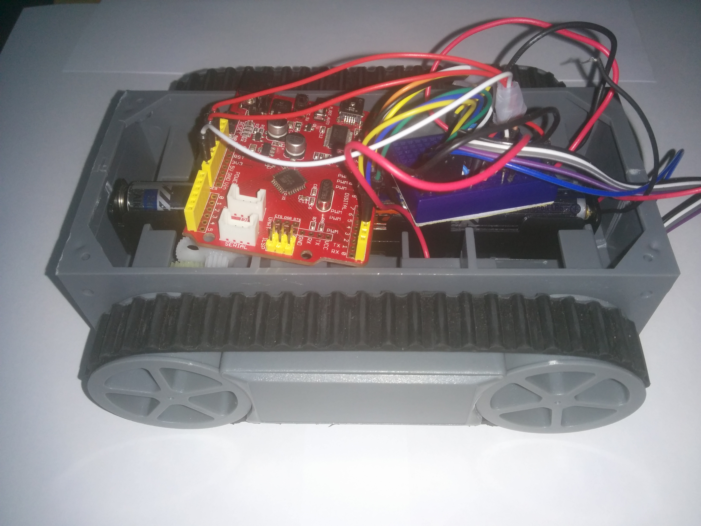

# Avtonomno vozilo

Namen delavnice je sestaviti avtonomno vozilo, ki s pomočjo IR senzorjev sledi črni črti na poligonu.

Vozilo sestavljajo nadlednje komponente:
* Podvozje s kolesi,
* arduino uno,
* H-bridge za krmiljenje motorjev,
* polje IR senzorjev(QTR-3A).

Spodaj je objavljen primer kode preprostega sledenja črti. Komentarji v kodi opisujejo delovanje programa.
Knjižnico QRTSensors dobimo tu: https://www.pololu.com/docs/0J19/2

    #include <QTRSensors.h>

    // V setup fazi v tem primeru arduino 10 sekund kalibrira senzor (prizgana led dioda)
    // V TEH DESETIH SEKUNDAH SENZOR IZPOSTAVITE CRNI IN BELI BARVI (najtemnejši in najsvetlejši vzorec)

    // If you want to skip the calibration phase, you can get the raw sensor readings
    // (pulse times from 0 to 2500 us) by calling qtrrc.read(sensorValues) instead of
    // qtrrc.readLine(sensorValues).

    // Glavna zanka programa prebere vrednosti in jih uporabi za približno zaznavo pozicije črte. 
    // Vrednosti senzorjev so normirane na vrednosti od 0 do 1000.
    // Zadnja vrednost (0,1000,2000,...) nam pove pod katerim senzorjem je bila črta nazadnje zaznana

    #define NUM_SENSORS   3     // Stevilo uporabljenih senzorjev
    #define TIMEOUT       2500  // Cakanje na senzorje (nepomembno v naši aplikaciji, pustimo privzeto)
    #define EMITTER_PIN   QTR_NO_EMITTER_PIN     // Nekateri modeli senzorja imajo dodano led diodo

    QTRSensorsRC qtrrc((unsigned char[]) {2,3,4}, // Stevilke pinov na katere so povezani senzorji
    NUM_SENSORS, TIMEOUT, EMITTER_PIN); 
    unsigned int sensorValues[NUM_SENSORS];

    void setup()
    {
      //nastavimo PIN-e motorjev
      pinMode(5,OUTPUT);
      pinMode(6,OUTPUT);
      pinMode(10,OUTPUT);
      pinMode(11,OUTPUT);

      //nastavimo PIN-e preprostega stikala
      pinMode(12,INPUT);
      pinMode(8,INPUT);
      digitalWrite(8,HIGH);
  
      Serial.begin(9600);
      Serial.print("Prizigam LED na PIN-u: ");
      Serial.println(LED_BUILTIN);
      delay(500);
      pinMode(LED_BUILTIN, OUTPUT);
      digitalWrite(LED_BUILTIN, HIGH);    // Arduino LED naznanja kalibracijo
      for (int i = 0; i < 400; i++)  // 400 vzorcev (25ms na klic * 400 = 10s)
      {
        qtrrc.calibrate();
      }
      digitalWrite(LED_BUILTIN, LOW);     // Arduino LED ugasnemo -> konec kalibracije
        
      //Izpis kalibriranih vrednosti
      for (int i = 0; i < NUM_SENSORS; i++)
      { 
        Serial.print("Senzor: ");
        Serial.print(i);
        Serial.print(" Minimum uporabljen za kalibracijo: ");
        Serial.print(qtrrc.calibratedMinimumOn[i]);
        Serial.print(" Maximum uporabljen za kalibracijo: ");
        Serial.print(qtrrc.calibratedMaximumOn[i]);
        Serial.println(' ');
      }
      Serial.println();
      Serial.println();
      delay(1000);
    }
    
    bool premik;
    void loop()
    {
      premik = false;
      premik = HIGH == digitalRead(12);
      if(premik){ // delaj samo ce je pin 12 povezan
        //Uporabi naslednjo vrstic če želiš uporabiti "surovo" podatke iz senzorja  
        //  qtrrc.read(sensorValues);
        unsigned int position = qtrrc.readLine(sensorValues)/1000;
        //Serial.println(position); // comment this line out if you are using raw values
         
        if(position==2){
          digitalWrite(5,HIGH);
          digitalWrite(10,LOW);
          //analogWrite(5,150);
          //analogWrite(10,150);
        }
        if(position==1){
          digitalWrite(5,HIGH);
          digitalWrite(10,HIGH);
          //analogWrite(5,150);
          //analogWrite(10,150);
        }
        if(position==0){
          digitalWrite(5,LOW);
          digitalWrite(10,HIGH);
          //analogWrite(5,0);
          //analogWrite(10,255);
        }
      }
    
      delay(50);
      digitalWrite(5,LOW);
      digitalWrite(10,LOW);
      //analogWrite(5,0);
      //analogWrite(10,0);
    }

