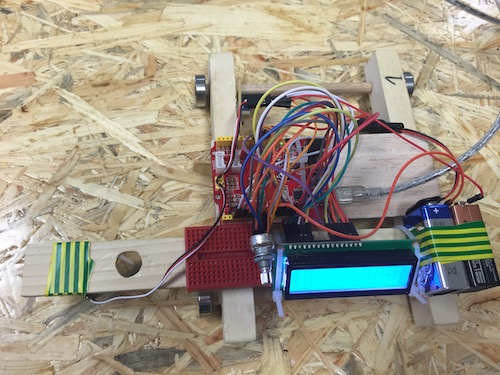
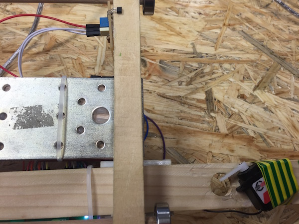
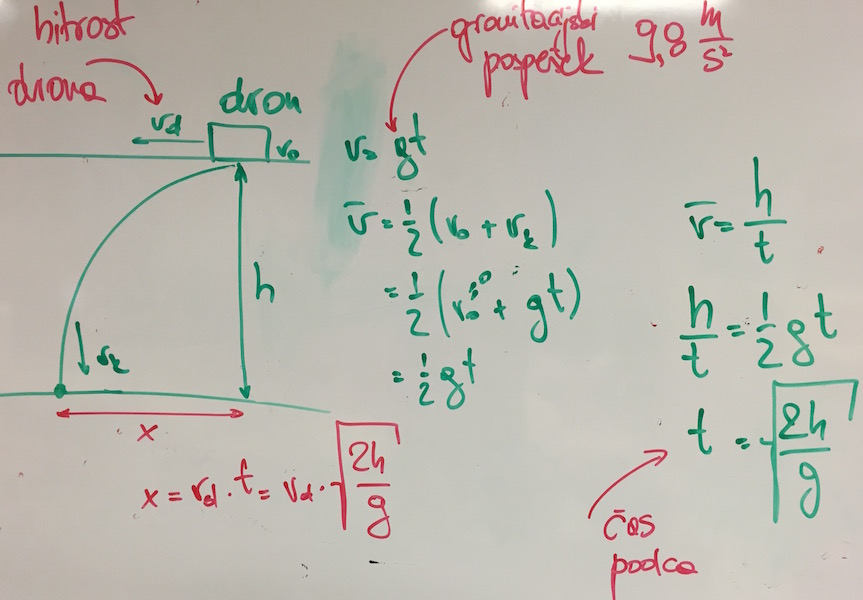

# Dron

Tokrat gre zares! Danes delamo z droni. Vzemi enega iz vzletne postaje (tračnic) in si ga malce oglej. Nekje na dronski ploščadi je ena luknja. Tja damo železno kuglico, ki jo bo dron nekam odvrgel (do tja še pridemo). Kako? Pod luknjico je servo motor. To je naprava, ki ji lahko povemo, da zasuka svojo os na določeni kot. Na osi servomotorja je ročica. Ta bo naši kuglici v eni poziciji zaostavila v luknjici, v drugi, sproščeni poziciji pa ji omogočila prosti pad.

Načrt za danes: najprej upravljamo z ročico servomotorja. Potem se spomnimo, kako smo [zadnjič šteli magnete](merilnik-hitrosti.md) na vzletni postaji. Potem spišemo kodo, kjer dron odvrže kuglo na, recimo, desetem magnetu. Tako, da pade kugla na cilj (v posodo). Huh, to je to. A ja. Če boš imel čas, se potem lahko gremo še malo fizike in pri ciljanju s kuglico upoštevamo hitrost.

## Servo motor

Na dronu je vse že zvezano. Danes ne žičkamo (Že znamo. Čeprav bi bilo zelo lušno, ampak bi nam zmanjkalo časa). Priključimo računalnik na dron (priključek USB) in dronski Arduino priključimo na baterije.

Najprej krmiljenje servo motorja. Servo motorju povemo, v kakšno lego naj postavi os. Lego osi sporočamo v kotnih stopinjah, od 0 do 180 stopinj. Na spodnji sliki je servo motor spodaj desno, zgoraj levo pa se vidi detektor za magnet.

Servo motor je pritrjen na ročico tako, da je v zaprti legi (kroglica ne pade) pravi kot 115 stopinj, v odprti pa okoli 160 stopinj. Servo motor je na pinu 10. Za upravljanje uporabimo knjižnico Servo (`#include <Servo.h>`). V kodi servo motorju dodelimo spremenljivko `myservo`, ki je tipa `Servo`. Ta spremenljivka je pravzaprav, podobno kot tista za LCD, objekt, ki zna početi različne stvari. Tako s klicem `myservo.attach(pin)` Arduinu pove, na katerem pinu je priključen servo motor. Z `myservo.write(kot)` povemo, na kateri kot naj se postavi os servomotorja. Z `myservo.deteach()` odklopimo servo motor, oziroma varčujemo z elektriko iz baterij.

Koda, ki vključuje zgornje ukaze, je spodaj.

    #include <Servo.h>

    int servoPin = 10;
    int servoStart = 115;  // start angle of the servo
    int servoEnd = 160;  // end position of the servo
    long start_time = millis();
    bool ball_dropped = false;

    Servo myservo;

    void setup() {
      myservo.attach(servoPin);
      myservo.write(servoStart);
    }

    void loop() {
      if ((millis() > start_time + 1000) and not ball_dropped) {
        myservo.write(servoEnd);
        delay(2000);
        myservo.write(servoStart);
        delay(1000);
        myservo.detach(); // switch off the servo to spare batteries
        ball_dropped = true;
      }
    }

> Kaj počne ta koda? Čemu služi spremenljivka ball_dropped?

Vzemi sedaj kovinsko kuglico, "napolni" dron, in poženi kodo. 

## Ciljanje tarče

Najprej štetje magnetov. Program za to smo spisali že zadnjič, zato lahko tu samo skopiramo spodnji program. Naloži ga na dron, priklopi ga na baterijo (z njo sicer šparaj, Elis pravi, da jih nimamo več na zalogi in ne bi bilo dobro, da crknejo pred koncem). Z dronom preštej, koliko magnetov je na dronski ploščadi. Na katerem magnetu je tarča?

    #include "LiquidCrystal.h"
    LiquidCrystal lcd(13, 12, 11, 6, 5, 4, 3);

    int count = 0;

    void magnet() {
      count = count + 1;
      lcd.clear();
      lcd.setCursor(0, 1);
      lcd.print(count);
    }

    void setup() {
      lcd.begin(16, 2);
      lcd.setCursor(0, 0);
      lcd.print("Frizider");
      attachInterrupt(digitalPinToInterrupt(2), magnet, RISING);
    }

    void loop() {
    }

## Ciljanje tarče

Tarčo smo postavili pod magnetom proti koncu dronske ploščadi. Spremeni zgornjo kodo tako, da dron ob prehodu čez ta magnet odvrže kroglo. 

  1. na vrh programa, kjer deklariramo spremenljivke, dodaj te za servo motor,
  2. dodaj tudi spremenljivko `bool dropped`, ki naj hrani stanje (smo kroglico že odvrgli?)
  3. v funkcijo `setup()` dodaj kodo, ki servo postavi v zaprti položaj (kroglica ne more pasti)
  4. v funkcijo `loop()` dodaj kodo za met kroglice. Začneš lahko recimo z vrstico `if (count == 2 and not dropped) {` za katero mora slediti blok kode, ki servo odpre, počaka sekundo, zapre, počaka sekundo, ga odklopi (`myservo.detach();`) in nastavi spremenljivko `dropped` na `true` oziroma pove, da smo kuglico že spustili. Slednje zato, da taga dela koda ne izvedemo več kot enkrat.

Bo šlo. Rabiš pomoč? Najprej poskusi sam. Če ne gre, vprašaj frižiderjevce. Če res, ampak res ne gre, je tu [plonk ceglc](plonk-ceglc.md).

## To je to. Razen ...

... če imaš še kaj časa. Če, potem bi bilo dobro tarčo prestaviti na tla. Recimo, kakšnih 1,25 m od dronove ročice za kroglico. Koliko časa pada kroglica do tal. Ah, enostavno:

Torej, pada `t = sqrt(2 * 1,25 m / (10 m / s^2))`. Tole smo zapisali malo računalniško, saj je `sqrt` v kakšni programski kodi oznaka za kvadratni koren. Torej, pada točno pol sekunde! 

Kakšno pot naredi v tem času. Hm, odvisno od hitrosti drona. Če je hitrost drona `vd`, potem naredi kroglica v pol sekudne pot `s = vd * t = vd * 0,5 s`. Ampak to smo računali že zadnjič. Če je hitrost drona recimo `1,5 m/s`, potem kroglica v pol sekunde naredi 0,75 m. Kar dosti.

Postavi sedaj tarčo 1 meter od magneta številka 10. Tvoj program naj računa hitrost. Ko dron prečka magnet številka 10, veš, da bi morala kroglica potovati še 1 m. Kdaj jo odvržeš? Hitrost drona imamo, vd. Pot, ki jo bo kroglica naredila po tem, ko jo odvržemo, je `s = vd * 0.5 s`. Do enega metra se bo potem morala še nekaj voziti. Dolžina te vožnje bo `sd = 1 m - s`. Če predpostavimo, da dron v tem času ne bo zgubljal hitrosti (v bistvu jo, ampak tukaj se delamo, da ne), potem bo pot `sd` prepotoval v času `t = sd/vd`. Super, tako `sd` kot `vd` znamo izračunati, zato znamo izračunati tudi `t`. Ta `t` pa je ravno čas, ki ga moramo počakati po tem, ko dron prečka 10-ti magnet da odvržemo magnet.

Sprogramiraj!

Uspešno ciljanje! Čestitamo! Prišel si do konca delavnice. Upamo, da je bila zanimiva. Pozdrave, 

Frižider.