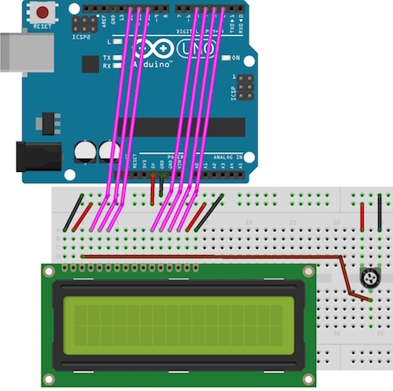
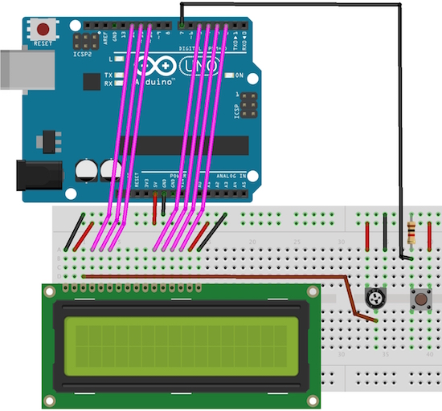

## LCD ekran

Na Arduino priklopimo dvovrstični prikazovalnik LCD. Tokrat je nekaj več žičk. 

Nova elektronski element je potenciometer, ki si ga lahko predstavljamo kot dva upora, katerih upornost zvezno uravnavamo tako, da je njuna skupna upornost vedno enaka nazivni vrednosti potenciometra (pri nas recimo 10kOhmov). Potenciometer tu izkoristimo za uravnavanje kontrasta na LCDju.

> Bilo bi čisto fino, če delovanje potenciometra preveriš z merilnikom napetosti. Boš znal? Razmisli! Pozitivni pol (rdečo žico) merilnika napetosti priključi na srednji kontakt potenciometra, negativni pol (črno žico) pa daj na maso.

Naš LCD ima dve vrstici s po 16 znaki. Za izpisovanje nanj uporabimo knjižnico [LiquidCrystal](https://www.arduino.cc/en/Reference/LiquidCrystal), ki nam strašno poenostavi izpisovanje na LCD. Kako, si oglejmo spodaj:

    #include "LiquidCrystal.h"
    LiquidCrystal lcd(12, 11, 10, 5, 4, 3, 2);
     
    void setup() {
      lcd.begin(16, 2);
      lcd.setCursor(0, 0);
      lcd.print("Frizider");
      lcd.setCursor(0, 1);
      lcd.print("Bombadron");
    }
     
    void loop() {
    }

Z vrstico `include` v program naložimo vmesnik knjižnice LiquidCrystal. V drugi vrstici inicializiramo knjižnico tako, da ji povemo, na katerih pinih imamo priključen LCD. Vrstni red pinov je seveda pomemben in mora za naše vezje biti prav tak, kot je naveden v zgornji kodi. S to vrstico smo inicializirali spremenljivko lcd, ki je tipa `LiquidCrystal`. Do sedaj smo imeli opravka s spremenljivkami tipa `int` in `long`, spremenljivka `lcd` pa je vsaj na videz precej drugačna od teh. In sicer je to spremenljivka, pravzaprav se njej reče kar objekt, ki ima metode, s katerimi počnemo razne stvari. Na primer, z metodo `begin` nastavimo tip prikazovalnika LCD (število vrstic in stolpcev). Z metodo `setCursor` povemo, na katerem mestu bi radi pričeli z našim izpisom; najprej navedemo kolono potem pa še vrstico. Z metodo `print` pa povemo, kaj bi radi izpisali.

Ko poženemo zgornji program, se ne zgodi prav dosti. Nič čudnega, saj je funkcija `loop` prazna. Kaj pa, če program spremenimo tako, da nam šteje sekunde od trenutka, ko smo pognali program?

    #include "LiquidCrystal.h"
    LiquidCrystal lcd(12, 11, 10, 5, 4, 3, 2);
     
    void setup() {
      lcd.begin(16, 2);
      lcd.setCursor(0, 0);
      lcd.print("Cas v sekundah");
    }
     
    void loop() {
      lcd.setCursor(0, 1);
      lcd.print(millis()/1000);
    }

## LCD šteje pritiske na tipko

Priklopimo na Arduino še tipko in izpisujmo število vklopov stikala. Na tipko smo vezali upor z upornostjo 1 kOhm (rjava ena, črna nič, rdeča dve ničli), da ob pritisku tipke skozi stikalo steče le majhen tok. Kot tok steče, je na uporu padec napetosti 5V in, glede na masto, na žički, ki smo jo iz upora zvezali na arduino na priključek sedem, napetost +5V. Ko stikalo ni vključeno, je napetost na tej žički 0V.

Tule je načrt: štejmo število klikov na tipko. Tule je rešitev:

    #include "LiquidCrystal.h"
    LiquidCrystal lcd(12, 11, 10, 5, 4, 3, 2);
    const int buttonPin = 7;
    int clicks = 0;
    int buttonState;

    void setup() {
      pinMode(buttonPin, INPUT);
      lcd.begin(16, 2);
      lcd.setCursor(0, 0);
      lcd.print("Klikni na tipko");
    }
     
    void loop() {
      lcd.setCursor(0, 1);
      buttonState = digitalRead(buttonPin);
      if (buttonState == HIGH) {
        clicks = clicks + 1;
        lcd.setCursor(0, 1);
        lcd.print(clicks);
        while (buttonState == HIGH) {
          buttonState = digitalRead(buttonPin);
        }
      }
    }

Zgoraj smo združili do sedaj že znane finte, tako da nam mora biti ta koda totalno razumljiva. V `setup` tokrat nastavimo vhodni pin za tipko. V glavni zanki `loop` čakamo na pritisk tipke, takrat števec pritiskov tipke `clicks` povečamo za ena, število izpišemo na LCD in počakamo, da se uporabnik sistema naveliča držati gumb. Ker se vse skupaj ponavlja, smo ravno razvili eno napravo, ki se ji reče števec.

## Timer

Vezje, ki ga imamo pred sabo, je zrelo za razvoj še ene naprave. Timer. Merilec časa med dvema klikom na stikalo. Dajmo razmisliti: ob pritisku na gumb bi želeli, da se timer ponastavi na nič in začne šteti čas, recimo sekunde. Ob ponovni pritisku naj se štetje ustavi. Ob naslednjem pritisku naj se timer spet ponastavi na nič in prične šteti. Ob naslednjem pritisku... Ok, to sedaj že vemo. Naprava ima torej dve stanji. Ali šteje ali pa stoji in kaže prej zmerjeni čas. V programu je najlažje, da si zapomnemo, v katerem stanju smo, in potem ob pritisku na tipku glede na to sanje ustrezno ukrepamo.

    #include "LiquidCrystal.h"
    LiquidCrystal lcd(12, 11, 10, 5, 4, 3, 2);
    const int buttonPin = 7;
    int counter;
    boolean counting = false;
    long startTime;

    void setup() {
      pinMode(buttonPin, INPUT);
      lcd.begin(16, 2);
      lcd.setCursor(0, 0);
      lcd.print("Cas v sekundah");
    }
     
    void loop() {
      float time;
      int buttonState;
      
      if (counting) {
        time = float(millis() - startTime) / 1000.0;
        lcd.setCursor(0, 1);
        lcd.print(time, 1);
      }
      
      buttonState = digitalRead(buttonPin);
      if (buttonState == HIGH) {
        while (buttonState == HIGH) {
          buttonState = digitalRead(buttonPin);
        }
        if (!counting) {
          startTime = millis();
          lcd.clear();
          lcd.setCursor(0, 0);
          lcd.print("Cas v sekundah");
        }
        counting = !counting;
      }
    }

Na začetku izvajanja, v funkciji `setup()`, spet samo nastavimo vhod za tipko in ponastavimo LCD. Glavne zadeve so znova sprogramirane v funkciji `loop()`. Tu preverjamo, ali štejemo čas. Stanje, ko štejemo čas, smo si tokrat zapomnili v spremenljivki `counting`. Ta je tipa `boolean`, kar pomeni, da ima dve vrednosti, `true` ali `false`. Blok kode, ki se začne z `if (!counting)` se torej izvede le, če ima `counting` vrednost `false`: `!` v tem pogoju pomeni negacijo, torej zanika vrednost spremenljivke `counting`. Po slovensko bi to prebrali z "če trenutno ne šteješ, potem". Se pravi, če ne šteješ, si pa pritisnil na gumb, potem začni šteti. To je, zapomni si čas v spremenljivki `startTime`, počisti LCD in spet izpiši zgornjo vrstico.

Še ena finta: ob vsakem pritisku na tipko se stanje, v katerem je števec, zamenja. To je enkrat štejemo, potem ne štejemo, potem štejemo... Tu bi zadevo lahko spisali s kakšnim stavkom `if ... else ...`, a ni potrebno. Ker je stanje binarno, shranjeno v spremenljivki `counting`, bo dovolj, da to stanje samo vsakič negiramo. To smo storili v stavku `counting = !counting;`. Huh, ena vrstica namesto štirih, če bi uporabili `if`!

> Kaj misliš, ali naš program začne šteti od 0 ko pritisnemo na tipko, ali ko tipko spustimo?

> Bi znal zgornjo kodo spremeniti tako, da bi s ponovnim pritiskom na tipko ponovno zagnali timer od časa, kjer je ta bil prej zaustavljen?

> Kako bi spremenil kodo programa tako, da bi timer ponastavil na nič le z daljšim, na primer dvosekundnim pritiskom na tipko?

## Dovolj je LCDjev!

Z dvovrstičnimi ekrani LCD se da početi še marsikaj zanimivega. Če imaš čas, ali pa te zanima prebrati še kaj več, si poglej dokumentacijo knjižnice [LiquidCrystal](https://www.arduino.cc/en/Reference/LiquidCrystal) ali pa kakšne tam opisane primere uporabe. Mi namreč moramo naprej, preden začnemo pisati program za bombadron je potrebno spoznati še en trik (prekinitve) in še en nov tip senzorjev.