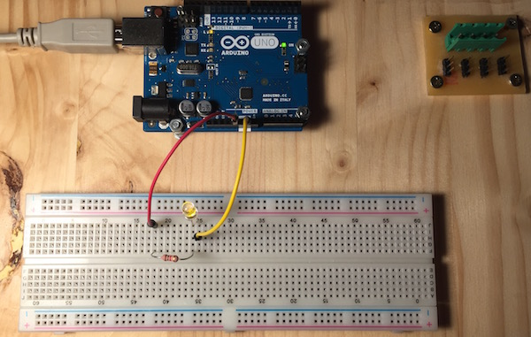

#Oprema
Začnemo iz nule. Na računalnik preko kabla USB priklopimo Arduino. Zasveti zelena LED dioda "ON" na Arduinu. 

Potem na arduino priklopimo LEDico. Zato, da se ne skuri, omejimo tok skozi diodo z uporom. Ta naj ima upornost približno 1Kohm. Vse skupaj povežemo na vezje s slike:

Oziroma, v živo, z opremo iz Frižiderja, bi vse skupaj lahko izgledalo nekako takole:

Če si vse prav priključil, bo LEDica zasvetila. Če ne sveti, jo obrni: LEDica ima dva priključka in ni vseeno, kateri je priključen na pozitivni in kateri na negativni pol napajanja. Tudi če ti sveti, jo lahko obrneš tako, da to več ne počne (čisto, da poskusiš, ali res ni vseeno, kako je obrnjena).

Opazil boš, da sta priključka LEDice različno dolga. Daljši mora gledati proti pozitivnemu polu. Kateri je ta? Na Arduinu si na priključek 5V priključil upor. Skozenj teče elektrika, ki gre potem skozi LEDico, ki je na drugi strani ozemljena (negativni pol). Prav priključena LEDica gori stalno. Arduino smo uporabili samo kot izvor napetosti. 

Kolikšna je skupna napetost na priključkih Arduina? Ok, je 5V, vsaj tako piše. Pa je res? Izmeri z univerzalnim merilnikom, katerega stikalo naj bo nastavljeno na VDC (V so Volti, enota za električno napetost, DC pa pomeni, da gre za enosmerni tok). Kako se napetost porazdeli med uporom in diodo? Če te ta zadeva muči, naredi še en eksperiment: namesto diode v vezje vključi še en enak (1Kohm) upor. Kako se napetost porazdeli med oba upora? Kaj pa, če namesto tega vzameš upor 10Kohm-ov? Kaj se zgodi, če 10Kohmski upor priključiš v vezje z LEDico?

Tole do sedaj je bolj razmišljanje o uporih, LEDicah in električnih vezjih. Gremo naprej, čas je, da uporabimo Arduino za še kaj drugega kot napajalnik.

#Prižiganje LEDice

Namesto na 5V upor na našem vezju povežimo na Arduinov priključek številka 2.

Radi bi, da naša LEDica utripa. Potrebno bo napisati ustrezni program. Na računalniku, na katerega smo priklopili Arduino, zaženemo istoimensko razvojno okolje oziroma program Arduino. V njem z New odpremo nov dokument - program. Če nam ni kdo kaj na računalniku spreminjal nastavitev, bi se moral odpreti urejevalnik s "praznim" blokom kode v programskem jeziku C:

    void setup() {
    }
    
    void loop() {
    }

Funkcija setup() se zažene takoj, ko se začne program izvajati. V njej ponavadi inicializiramo spremenljivke, vhodno-izhodne pine in različne naprave (senzorji, moduli). Ko se funkcija setup() izvede, se začne periodično izvajati funkcija loop(). V funkciji loop() ponavadi beremo in spreminjamo vrednost spremenljivk, ter pišemo in beremo podatke iz različnih naprav(senzorji, moduli) in vhodno-izhodnih pinov.

Če želimo prižgati LED diodo, moramo najprej v funkciji setup() nastaviti pin2 tako, da povemo, da bo tam izhod (do nastavljanja pin tako, da bomo na njem brali, recimo, stanje stikala, še pridemo). To naredimo tako, da uporabimo funkcijo pinMode(). 

    pinMode(2, OUTPUT);

Temu `pinMode` rečemo "funkcija". Arduino ima veliko funkcij (da ne govorimo o tem, da si lahko izmišljamo še svoje). Funkcije v programih niso kot funkcije v matematiki; funkcije v programih so bolj kot nekakšni "ukazi". Ukazi (funkcije) imajo lahko argumente; te zapišemo v oklepaje za ukazom. Z ukazom `pinMode` torej Arduino "povemo", kateri pin naj ima kakšno vlogo. Ukaz ima dva argumenta, prvi je številka pina, drugi je vloga. Vloga je lahko `OUTPUT` ali `INPUT`; tole hočemo `OUTPUT`, zato torej

V funkcijo loop() spišemo kodo, s katero LEDico najprej vklopimo potem pa izklopimo. Uporabimo funkciji `digitalWrite` in `delay`.

    setup(){
        pinMode(2, OUTPUT); // pin 2 nastavimo kot izhod
    }
    
    void loop() {
      digitalWrite(2, HIGH); // na pinu 2 naj bo napetost 5V
      delay(1000);           // počakaj 1000 ms
      digitalWrite(2, LOW);  // na pinu 2 naj bo napetost 0V
      delay(1000);           // počakaj 1000 ms
    }

Program poženemo (gumb s puščico v desno v ukazni vrstici okna urejevalnika). 

Utripa?

Zadevo bi radi malo poživili. Recimo tako, da LEDica utripa hitreje. Seveda lahko na dveh mestih spremenimo program (kje?), ampak ker računalničarji naradi trošimo svojo energijo po nepotrebnem, bo veliko bolje, da program spišemo tako, da časa čakanja spreminjamo na enem samem mestu. Za tako stvar uvedemo spremenljivko. Naša spremenljivka nam bo hranila vrednost, za koliko milisekund nam naj po vklopu in izklopu LEDice Arduino čaka. Spremenljivko imenujmo `cakalniCas`.

    long cakalniCas = 200;
    
    setup(){
        pinMode(2, OUTPUT); // pin 2 nastavimo kot izhod
    }
    
    void loop() {
      digitalWrite(2, HIGH);
      delay(cakalniCas);
      digitalWrite(2, LOW);
      delay(cakalniCas);
    }

Spremenljivke v programskem jeziku C je potrebno pred uporabo napovedati, oziroma deklarirati. Povedati moramo predvsem, kakšnega *tipa* je spremenljivka. Naša spremenljivka `cakalniCas` je celo število. Celih števil pa je več sort. Recimo tri: `byte`, `int` in `long`. Razlikujejo se potem, kako velika smejo biti: spremenljivke vrste `byte` lahko vsebujejo števila od -128 do 127, `int` od -32768 do 32767, `long` pa od -2147483648 do 2147483647. Zakaj ta izbira? In zakaj prav takšna? `byte` zasede en bajt pomnilnika, `int` zasede dva in `long` zasede štiri. V en bajte je mogoče zapisati 255 različnih števil, v dva 65536 in v štiri 4294967296. Zakaj -128 in +127, ne pa -127 in +128 pa je tema za kdaj drugič.

Danes lahko brez skrbi uporabljamo `long`; pri daljših programih pa bo morda potrebno varčevati s pomnilnikom, zato bomo takrat uporabljali le tolikšna števila, kot bo potrebno.

Spremeni sedaj zgornji program tako, da LEDica utripa še hitreje. Ali pa res počasi. Vsakič boš moral nastaviti začetno vrednost spremenljivke in naložiti program na Arduino. 

Spremenljivka `cakalniCas` se v našem programu pravzaprav ne spreminja. Ostaja konstantna. Čas je, da to spremenimo. Recimo, napišimo program, ki prične z izjemno hitrim utripanjem, a vsakič čas čakanja poveča, recimo, za 5 ms.

    long cakalniCas = 10;
    
    void setup(){
      pinMode(2, OUTPUT); // pin 2 nastavimo kot izhod
    }
    
    void loop() {
      digitalWrite(2, HIGH);
      delay(cakalniCas);
      digitalWrite(2, LOW);
      delay(cakalniCas);
      cakalniCas = cakalniCas + 5;
    }

## Čas

Spremenljivke smo spoznali, da bi si lahko vanje zapišemo, kdaj bo potrebno ugasniti ali prižgati LEDico. Le še to moramo izvedeti, kako izvedeti, koliko je ura. Temu služi funkcija `millis`. Pove nam, koliko milisekund je minilo odkar se je začel izvajati program. To, kdaj je začel meriti, pravzaprav niti ni tako pomembno; lahko si predstavljamo, da gre za čas v milisekundah od jutra ali od treh popoldan včeraj; to bo, kot bomo videli, vseeno.

Za začetek zastavimo nekoliko manj ambiciozen cilj: dioda ne bo utripala, temveč se bo v začetku izvajanja programa prižgala, nato pa čez eno sekundo ustavila. Funkcijo `millis()` bomo uporabili nekako takole:

    long switchOffAt;

    void setup() {
        pinMode(2, OUTPUT);
        digitalWrite(2, HIGH);
        switchOffAt = millis() + 1000;
    }

    void loop() {
    }

To je popolnoma enako prvemu programu, le da si po tem, ko diodo prižgemo, zapomnimo, da jo je potrebno ugasniti ob trenutnem času + 1000 milisekund, se pravi, čez eno sekundo.

Ne spreglejte, da smo funkcijo *poklicali brez argumentov*. Brez, zato ker jih pač nima in noče. *Poklicali* pa zato, ker moramo kljub temu, da nima argumentov, napisati oklepaje, pa čeprav prazne. *millis* je le ime funkcije; oklepaji pa pomenijo, da jo hočemo poklicati, pa najsibo kaj v njih ali ne.

Manjka seveda še ugašanje. Potrebovali bomo nekaj takšnega: če je trenutni čas enak temu, ki smo ga shranili v `switchOffAt`, ugasni LEDico. Kako pa se pove to?

## Pogojni stavki

Približno takole

    long switchOffAt;
    
    void setup() {
        pinMode(2, OUTPUT);
        digitalWrite(2, HIGH);
        switchOffAt = millis() + 1000;
    }
    
    void loop() {
        if (millis() == switchOffAt)
            digitalWrite(2, LOW);
    }

Novost tule je `if`. Čeprav mu sledijo oklepaji, to ni funkcija, ki bi jo poklicali. V (okroglih) oklepajih je pogoj, ki odloča, ali se bo tisto, kar sledi `if`-u zgodilo ali ne.

Pogoj navadno vsebuje kakšno primerjavo. V tem primeru preverjamo, ali je trenutni čas enak času, v katerem je potrebno diodo ugasniti. Ali sta dve stvari enaki, preverimo z dvojnim enačajem, `millis() == switchOffAt` in ne enojnim `millis() = switchOffAt`. Enojni enačaj je namenjen prirejanju, dvojni primerjanju.

Program sicer lahko poženete in bo včasih deloval, ni pa nujno. Arduino sicer res stalno kliče naš `loop`, vendar se lahko zgodi, da bo ravno zamudil točen čas, v katerem želimo ugasniti diodo. V izogib težavam bomo v pogoj napisali, da mora biti čas večji ali enak `switchOffAt`.

    long switchOffAt;
    
    void setup() {
        pinMode(2, OUTPUT);
        digitalWrite(2, HIGH);
        switchOffAt = millis() + 1000;
    }
    
    void loop() {
        if (millis() >= switchOffAt)
            digitalWrite(2, LOW);
    }

`if`-u lahko sledi - in mu pogosto tudi bo sledilo - kaj daljšega kot le en klic. Recimo, da bi hoteli, ko preteče čas, ugasniti diodo, poleg tega pa postaviti spremenljivko `x` na 1 in spremenljivko `y` na 2.

    void loop() {
        if (millis() >= switchOffAt)
            digitalWrite(2, LOW);
            x = 1;
            y = 2;
    }

To ne deluje. Čeprav smo zgledno zamikali vrstice, je za Arduino to isto, kot če bi napisali

    void loop() {
    if (millis() >= switchOffAt)
    digitalWrite(2, LOW);
    x = 1;
    y = 2;
    }

If odloča le o ukazu (klicu funkcije, prirejanju...), ki mu sledi. Le o prvem, torej. Vrstici `x = 1;` in `y = 2;` nista znotraj `if`-a in se izvedeta v vsakem primeru. Če hočemo z `if`-om nadzorovati več vrstic, ju zapremo v "blok".

    void loop() {
        if (millis() >= switchOffAt) {
            digitalWrite(2, LOW);
            x = 1;
            y = 2;
        }
        z = 4;
    }

Zdaj se tudi prirejanji `x = 1;` in `y = 2;` izvedeta le, če je minilo dovolj časa, `z = 4;` pa vedno.

Dogovorimo se, da bomo oklepaje za `if`-om pisali tudi, kadar mu bo sledil le en ukaz. Ta navada vas bo obvarovala mnogih zoprnih napak.

    long switchOffAt;
    
    void setup() {
        pinMode(2, OUTPUT);
        digitalWrite(2, HIGH);
        switchOffAt = millis() + 1000;
    }
    
    void loop() {
        if (millis() >= switchOffAt) {
            digitalWrite(2, LOW);
        }
    }

Če program pozorno pogledamo, opazimo, da bo po preteku ene sekunde stalno ugašal in ugašal diodo. Nič hudega, to se tako ali tako ne bo poznalo.

## Utripanje

Če hočemo, da bo dioda utripala, bomo morali takrat, ko jo ugasnemo, zapisati, kdaj jo bo potrebno spet prižgati. V zanki, `loop`, ne bomo prežali le na ugašanje, temveč tudi na prižiganje. In ko jo prižgemo bomo, tako kot že doslej, zapisali, kdaj jo je potrebno ugasniti.

    long switchOffAt, switchOnAt;
    
    void setup() {
        pinMode(2, OUTPUT);
        digitalWrite(2, HIGH);
        switchOffAt = millis() + 1000;
        switchOnAt = millis() + 10000000;
    }
    
    void loop() {
        if (millis() >= switchOffAt) {
            digitalWrite(2, LOW);
            switchOnAt = millis() + 1000;
        }
        if (millis() >= switchOnAt) {
            digitalWrite(2, HIGH);
            switchOffAt = millis() + 1000;
        }
    }

V začetku smo nastavili `switchOnAt` na neko ogromno vrednost, da ne bi slučajno česa sprožila.

Poženimo program - in vidimo, da ne deluje. Dioda se prižge in ugasne - ter ne prižge več.

Dobrodošli v svetu iskanja trdovratnih čudnih napak.

Tule se zgodi naslednje: dioda se prižge in zapomnimo si čas, ko jo je potrebno ugasniti. Ko mine sekunda (`millis() > switchOffAt`), se dioda ugasne in zabeležimo čas, ko jo bo potrebno spet prižgati, namreč eno sekundo od tega trenutka. Arduino nato spet pokliče `loop`. Ker je čas za ugašanje že napočil (`millis() > switchOffAt`), se dioda ugasne (a ni bila že ugasnjena?) in zapomnimo čas, ko jo je potrebno ugasniti, namreč eno sekundo od tega trenutka. Arduino nato spet pokliče `loop`. Ker je čas za ugašanje že napočil (`millis() > switchOffAt`), se dioda ugasne (a ni bila že ugasnjena?) in zapomnimo čas, ko jo je potrebno ugasniti, namreč eno sekundo od tega trenutka...

(Ugasnjena) Dioda se vedno znova ugaša, čas, ko jo bomo ponovno prižgali pa se znova in znova odmika za eno sekundo v prihodnost. Popravek je preprost.

    long switchOffAt, switchOnAt;
    
    void setup() {
        pinMode(2, OUTPUT);
        digitalWrite(2, HIGH);
        switchOffAt = millis() + 1000;
        switchOnAt = millis() + 10000000;
    }
    
    void loop() {
        if (millis() >= switchOffAt) {
            digitalWrite(2, LOW);
            switchOnAt = millis() + 1000;
            switchOffAt = millis() + 10000000;
        }
        if (millis() >= switchOnAt) {
            digitalWrite(2, HIGH);
            switchOffAt = millis() + 1000;
            switchOnAt = millis() + 10000000;
        }
    }

Z vrsticama 

            switchOnAt = millis() + 1000;
            switchOffAt = millis() + 10000000;

dosežemo, da se bo prižiganje zgodilo čez eno sekundo, ugašanje pa "enkrat kasneje". Namesto milijon bi lahko napisali tudi dva tisoč, pa bi bilo ravno tako dovolj. Da pomembno je le, da prižgemo, preden bomo ponovno ugašali.

Pri prižiganju se zgodba ponovi: ugašanje bo čez eno sekundo, prižiganje enkrat veliko kasneje.

Še eno zvitost si privoščimo. Poenostavimo `setup`. Iz njega lahko vržemo prižiganje, pač pa postavimo `switchOnAt = millis()`, tako da se bo dioda prižgala takoj ob prvem klicu `loop`.

    long switchOffAt, switchOnAt;
    
    void setup() {
        pinMode(2, OUTPUT);
        switchOffAt = millis() + 1000;
        switchOnAt = millis();
    }
    
    void loop() {
        if (millis() >= switchOffAt) {
            digitalWrite(2, LOW);
            switchOnAt = millis() + 1000;
            switchOffAt = millis() + 10000000;
        }
        if (millis() >= switchOnAt) {
            digitalWrite(2, HIGH);
            switchOffAt = millis() + 1000;
            switchOnAt = millis() + 10000000;
        }
    }

## Gnezdeni pogoji, stanja

Poskusimo še nekaj bolj premetenega: namesto dveh spremenljivk, `switchOnAt` in `switchOffAt` imejmo le eno. No, le dve. :) Prva bo `switchAt`, ki bo povedala, kdaj je potrebno spremeniti stanje diode. Druga bo `nextState`, ki bo povedala, na kaj jo je potrebno spremeniti.

    long switchAt;
    byte nextState;
    
    void setup() {
        pinMode(2, OUTPUT);
        switchAt = millis();
        nextState = HIGH;
    }
    
    void loop() {
        if (millis() >= switchAt) {
            digitalWrite(2, nextState);
            
            switchAt = millis() + 1000;
            if (nextState == HIGH) {
                nextState = LOW;
            }
            else {
                nextState = HIGH;
            }
        }
    }

V `setup` zabeležimo, da želimo, da `loop` takoj spremeni stanje diode, pri čemer naj bo to, naslednje stanje, `nextState`, enako `HIGH`. Za `nextState` smo rekli, naj bo tipa `byte`. Tako, za vajo.

V `loop` preverimo, ali je že čas za akcijo. Če je, pač nastavimo pin 2 na `nextState`. Nato si zapomnimo, kdaj bo čas za naslednjo spremembo, `switchAt = millis()`. Nato zapišemo še, na kaj bo potrebno spremeniti stanje. Če je trenutno stanje `HIGH`, naj bo naslednje stanje `LOW` in obratno. Za "in obratno" uporabimo `else`: `else` lahko sledi `if`-u in pove, kaj naj se zgodi, če pogoj ni bil resničen.

Ne spreglejmo, da se vse tole, kar smo pisali v `loop` godi znotraj `if`-a. Da, znotraj `if`-a imamo še en `if`. Pogoj v notranjem `if` se seveda preverja in upošteva le, če je bil izpolnjen pogoj iz zunanjega.

## Picajzlanje

Bodimo še malenkost picajzlasti. Tudi ta dioda ne utripa nujno vsako sekundo. Problem je tule

            switchAt = millis() + 1000;

S tem povemo, da je čas za naslednjo spremembo 1000 milisekund po *trenutnem* času. Če hočemo utripanje na sekundo (z malenkostnimi zamiki v vsakem krogu, vendar ne takšnimi, da bi se nabirali), moramo reči, da je čas za novo spremembo *eno sekundo po tej spremembi*, torej

            switchAt = switchAt + 1000;

Zdaj bo utripanje toliko natančno, kot je natančna Arduinova ura. To pa je, za naše potrebe, čisto in povsem natančno.
