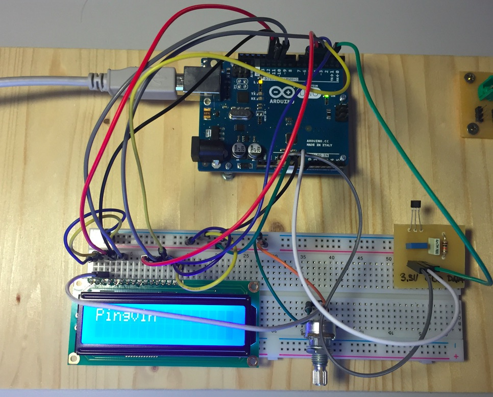
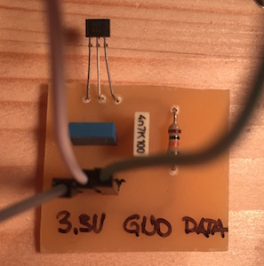
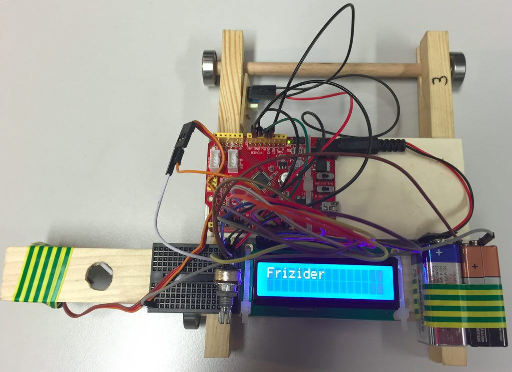

# Merilnik hitrosti

Zdaj pa vse skupaj: torej, imamo magnetni senzor in prikazovalnik LCD. Radi bi pisali po LCDju in spreminjali zapis ob aktivaciji magnetnega senzorja.

## Začnemo z vezjem

Najprej zvežemo vezje z LCD-jem. [To že znamo](lcd.md). Sprememba je le, da namesto na Arduino PIN dva ta izhod iz LCD-ja zvežemo na pin 6. To pa zato, ker bomo pin 2 rabili za magnetni senzor.

Na pin 2 nato povežemo magnetni senzor. Pin DATA (čisto desno, glej spodnjo sliko) iz magnetnega senzorja gre na pin 2 Arduina. Pin 3,3V (levo) gre na napajalni priključek 3,3V Arduina. Pin GND (sredina, ozemljitev) gre na priključek GND Arduina.

Za začetek uporabimo spodnji program. Kaj počne program? Nič pametnega, namenjen je samo temu, da preveri, ali nam LCD dela.

    #include "LiquidCrystal.h"
    LiquidCrystal lcd(12, 11, 10, 5, 4, 3, 6);

    void setup() {
      lcd.begin(16, 2);
      lcd.setCursor(0, 0);
      lcd.print("Frizider");
    }

    void loop() {
    }

Zdaj bi bilo dobro zgornji program spremeniti, da uporabi še magnetni senzor. Hm. V funkciji `setup()` bi najprej morali sploh povedati, da magnetni senzor imamo in da smo ga priklopili na pin 2. To naredimo s spodnjim stavkom (smiselno ga vključi v program):

    attachInterrupt(digitalPinToInterrupt(2), magnet, RISING);

Aja, to že poznamo. [Prekinitve](prekinitve.md). Zgornje pravi, da ko bomo šli z magnetom mimo senzorja, bo ta na izhodu dal višjo napetost, to povišanje (angleško "rising") pa bo Arduino prepoznal in bo takrat prekinil vse ostalo, kar pač takrat počne, in poklical funkcijo `magnet()`.

Torej moramo nekam v program dodati še to funkcijo `magnet()`. Recimo, da ta nekaj izpiše na LCD:

    void magnet() {
      lcd.clear();
      lcd.print("Pingvin");
    }

Najbolje, da jo dodamo pred funkcijo `setup()`. Naš program bo sedaj izgledal takole:

    #include "LiquidCrystal.h"
    LiquidCrystal lcd(12, 11, 10, 5, 4, 3, 6);

    void magnet() {
      lcd.clear();
      lcd.print("Pingvin");
    }

    void setup() {
      lcd.begin(16, 2);
      lcd.setCursor(0, 0);
      lcd.print("Frizider");
      attachInterrupt(digitalPinToInterrupt(2), magnet, RISING);
    }

    void loop() {
    }

> Kaj počne naš program? 
> Ali z večkratnim prehodom magneta čez magneti senzor kaj 
> posebnega spremenimo?

## Štetje prehodov magneta

Znamo spremeniti zgornji program tako, da šteje, kolikokrat smo z magnetom šli čez magnetni senzor? Znamo! Deklarirati bomo morali novo spremenljivko ki šteje prehode in jo ob deklaraciji nastaviti na 0:

    int count = 0;

Deklaracijo vključi jo v program na primerno mesto. V funkciji `magnet()` moramo povečati ta števec za eno:

    count = count + 1;

Spomnimo se, funkcija `magnet()` se pokliče vsakič, ko gremo z magnetom mimo senzorja.

Zdaj v funkciji `magnet()` vsakič samo še izpišemo vrednost spremenljivke `count` in zadeva je končana. 

> Boš znal? Poskusi! Če ne, pa vprašaj frižiderce za pomoč. A pred tem vsekakor poskusi sam. Ne boj se napak. Pogum!

## Izpis časa med prehodi magneta

Skupaj s števili prehodov lahko izpisujemo čas med dvema prehodoma. Čas merimo v milisekundah, funkcija `millis()` pa nam vrne čas od trenutka, ko smo naložili program na Arduino. Zapomniti si bomo morali čas zadnjega prehoda megneta. V ta namen uvedimo spremenljivko `last_time`, ki naj ima kot začetno vrednost to, ki nam jo ob uvedbi te spremenljivke vrne funkcija `millis()`:

    long last_time = millis();

Pa izpis? Seveda lahko to naredimo v funkciji `magnet()`. Najprej bomo morali ugotoviti, koliko časa je preteklo od zadnjega prehoda magneta. Ta razlika je kar razlika med trenutnim časom in časom zadnjega prehoda:

    time_passed = millis() - last_time;

Zdaj le še izpišemo time_passed. Lahko kar v milisekundah, lahko pa spremeniš kodo tako, da izpisuješ, recimo, raje kar sekunde med dvema prehodoma magneta. Takoj po izračunu vrednosti `time_passed`, v funkciji `magnet()`, ne smemo pozabiti nastaviti novo vrednost spremenljivki `last_time`, ki hrani, kdaj je šel magnet zadnjič čez senzor:

    last_time = millis();

> Sestavi program tako, da v prvo vrstico izpišeš število prehodov magneta, v drugo pa čas med dvema prehodoma.

Gre? Mora iti. Znaš že za sestaviti zgornji program. Če kje škripa, malo povprašaj frižiderce. Če pa prav zares nikakor ne gre, poglej na [plonk ceglc](plonk-ceglc.md).

## Hitrost

Začnemo lahko, počasi, razmišljati o našem dronu in tračnicah. Na tračnicah so magneti pritrjeni vsakih 20 cm. Recimo, ampak samo recimo, da dron poženemo po tračnicah. Bilo bi fino vedeti, kako hiter je. Čas med posameznimi magneti poznamo, pot tudi. Bravo, enostavno! Iz tega lahko izračunamo hitrost. Zmenimo se za oznake: za hitrost bomo uporabili *v*, za pot *s* in za čas, ki ga dron potrebuje med dvema magnetoma, *t*. Hitrost nam pove, kakšno pot naredimo v določenem času, torej *v=s/t*. V jeziku C in upoštevajoč, da je časovna razlika med dvema magnetom zapisana v spremenljivki `time_passed`:

    v = 0.2 / time_passed * 1000;

Spremenljivka v je realno število, torej jo bo potrebno deklarirati kot tako:

    float v;

> Kam boš postavil zgornjo vrstico z deklaracijo spremenljivke v? Kam pa vrstico z izračunom hitrosti?

Ostane nam le še, da hitrost izpišemo.

> V kakšnih enotah izpisujem hitrost? Zakaj smo v izračunu hitrosti uporabili 0.2 in ne 20? In zakaj smo na koncu množili z * 1000?

Najprej poskusimo brez drona, kar z vezjem, ki smo ga sestavili o sedaj. Pri tem prehode prek magnetom simuliramo tako, kot do sedaj: magnet pač potegnemo preko senzorja. Takemu načinu preverjanja dela naprave pravimo *simulacija*.

Bo šlo? Tudi tokrat je na volj [plonk ceglc](plonk-ceglc.md), ampak če se le da, ga ne uporabi.

> Spremeni program tako, da hitrost izpisuje v kilometrih na uro.

## Dron

Končno! Dron. Danes bomo samo merili hitrosti. LCD ekran je na Frižiderjevem dronu povezan malce drugače. Dovolj bo, da v programu namesto obsteječe uporabiš tole vrstico:

    LiquidCrystal lcd(13, 12, 11, 6, 5, 4, 3);

Spremeni, priklopi USB priključek računalnika na dronov, pretoči program v dron, poveži Arduino z baterijo, in na tračnice. 

> Kakšne hitrosti dosega zadeva? Je to hitreje, kot hitra hoja? Kako se hitros spreminja s silo, s katero poženeš dron po tračnicah?

> Bi znal program spremeniti tako, da izpisoval hitrosti na med zadnjimi nekaj magneti? To je, namesto ene hitrosti bi jih izpisal, recimo, tri?

Toliko za tokrat. Kar nas še čaka je delo s servomotorjem in spuščanje krogle iz drona. Oziroma bombadrona. Naslednjič.