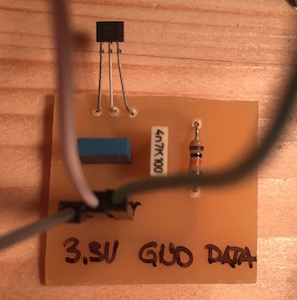

## Prekinitve

Oh ne, že spet LEDice! S stikalom bomo vklapljali in izkljapljali LEDico. Ok, vem, tole smo že počeli. A namesto stalnega preverjanja, ali je slučajno gumb na stikalu pritisnjen ali ne bomo uporabili nekaj, čemur pravimo *prekinitev* ali v angleščini *interrupt*. Ideja je naslednja: ko pritisnemo na stikalo, napetost na pinu, na katerega je priključen, naraste (angleško *rising*) iz 0V na 5V. Ob tem dogodku naj se v programu pokliče ena naša funkcija, recimo `buttonPressed`. Ta naj postori vse kar je treba postoriti ob pritisku tipke.

Torej, cilj: LEDica naj na začetku svetu. Ko pritisnemu tipko, naj ob stisku tipke LEDica ugasne.

Začnemo z vezjem:

Program je tokrat silno enostaven:

    const int ledPin = 7;

    void buttonPressed() {
      digitalWrite(ledPin, LOW);
    }

    void setup() {
      pinMode(ledPin, OUTPUT);
      digitalWrite(ledPin, HIGH);
      attachInterrupt(digitalPinToInterrupt(2), buttonPressed, RISING);
    }
     
    void loop() {
    }

Ob zagonu programa v funkciji `setup` najprej prižgemo LEDico na pinu `ledPin`. Sledi čarovnija. Funkcija `attachInterrupt` pove Arduinu, da naj pokliče funkcijo `buttonPressed`, ko se na pinu 2 dvigne napetost (iz 0V na 5V). V funkciji `buttonPressed` ugasnemo ledico na `ledPin`. Ker smo na pin 2 priključili stikalo, to pomeni, da bomo s pritiskom stikala po zagonu programa ledico ugasnili.

## Magnetno stikalo

Čas je, da tipko zamenjamo s čem drugim. Z senzorjem za magnetno polje! Program ostane enak kot prej. Stikalo pa zamenjamo. Uporabimo frižiderjevo magnetno stikalo. Pazimo, da ga priključimo na prave spojke. Napaja se recimo s 3,3V - še sreča, da ima Arduino izhod tudi za to napetost.

Torej, tako, kot je na zgornji sliki: senzor priklopimo na 3,3V, srednji pin na maso (0V) in desnega na Arduinov pin 2. Poženi program, vzami v roke kakšen magnet, in poskusi, ali deluje. Če ne, obrni magnet in poskusi še enkrat. Ni namreč vseeno, kateri pol približaš senzorju.

Tako, nared smo za bombadrona. Spoznali smo vse, kar je potrebno. Naslednjič programiramo torej vozičke na tračnicah in, recimo, pričnemo s štetjem magnetkov, ki so porazdeljeni po vsej dolžini tračnic in bodo aktivirali naš magnetni senzor na vozičkih.
