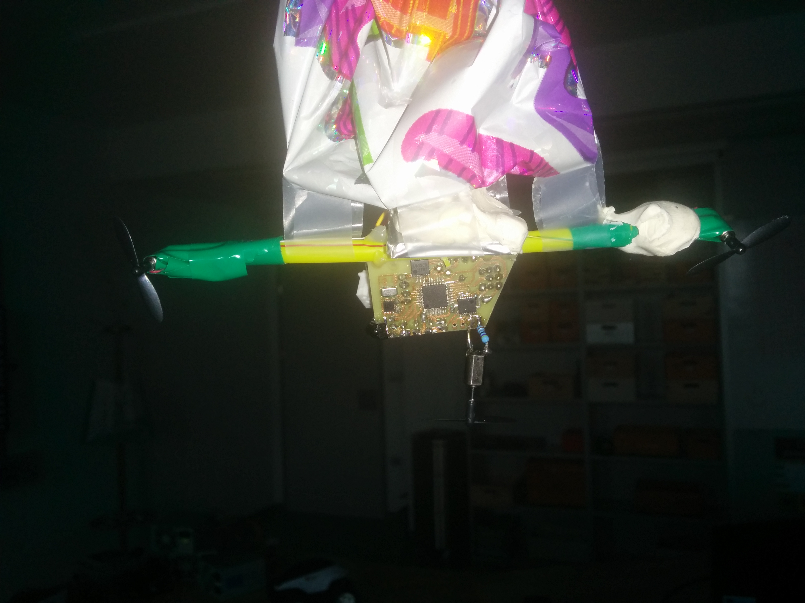

# cepelini

Namen delavnice je sestaviti cepelin, ki ga upravljamo s pomočjo IR daljinca.

Cepelin sestavljajo naslednje komponente:
* Balon napolnjen s helijem,
* mikrokontroler atmega328p,
* H-bridge,
* senzor vlage,
* temperaturni senzor,
* motorji s propelerji,
* dve led diodi.

