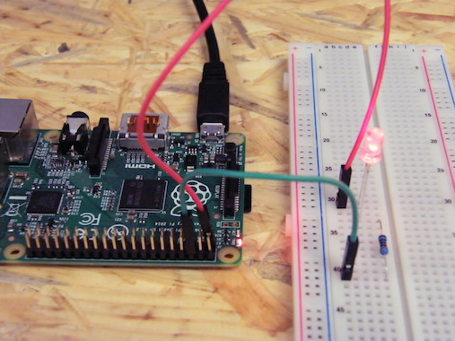
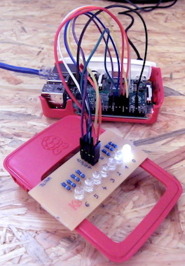
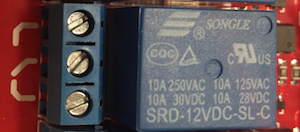
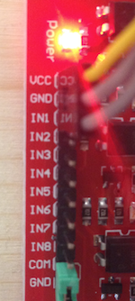
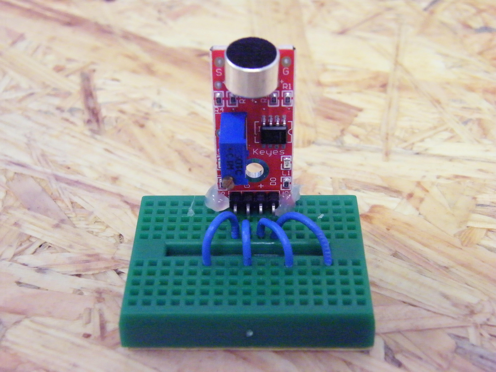
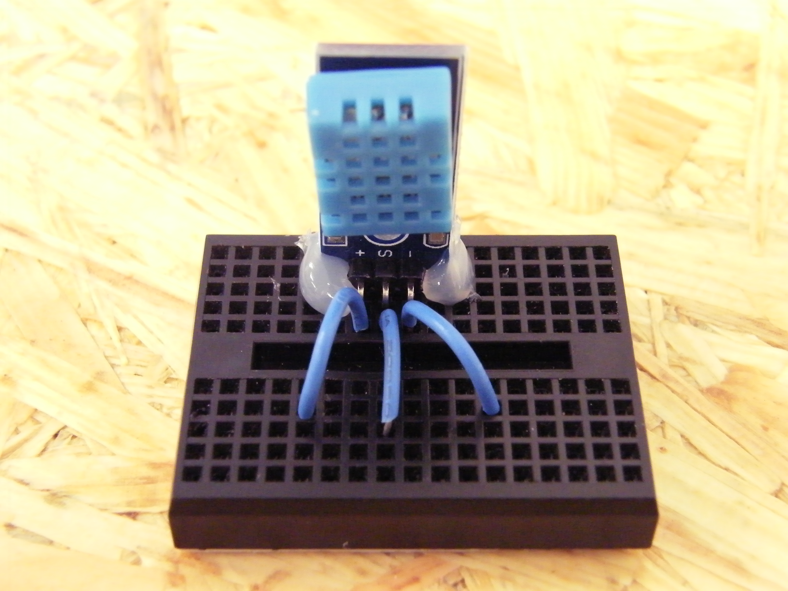
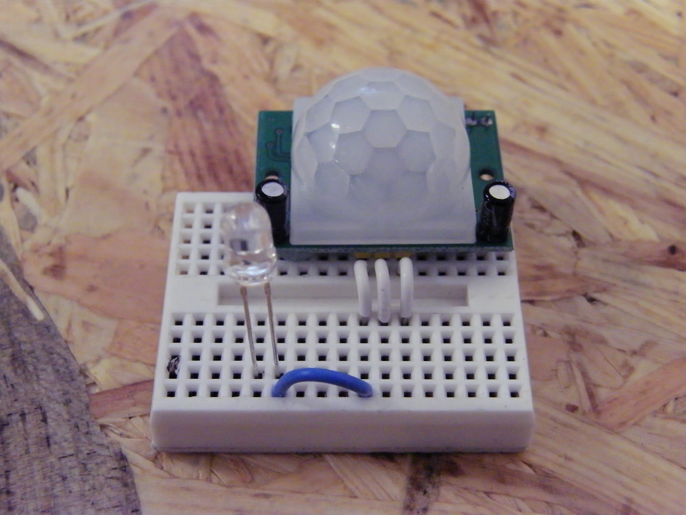
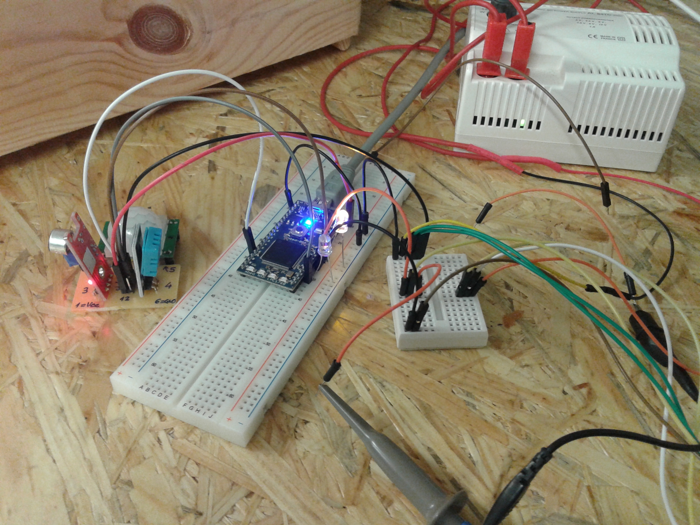
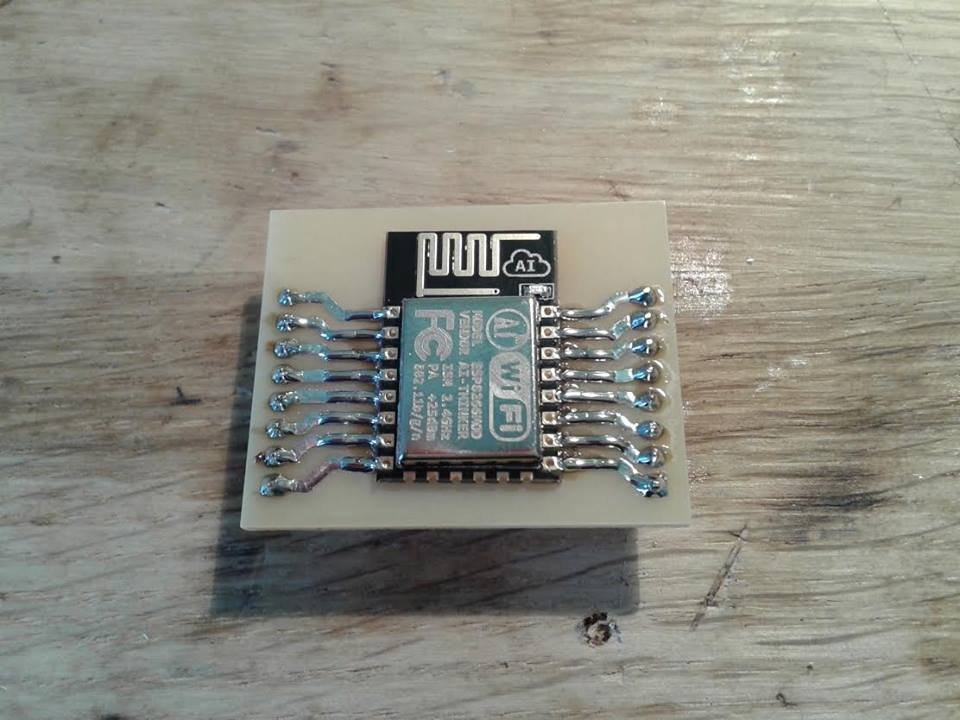

# Računalnik, na katerega lahko kaj priključimo

RaspberryPi je majhen računalnik. Zmore približno toliko, kot so zmogli računalniki pred dvajsetimi leti. Ima pa prednost: stane 40 evrov. In še večjo prednost: nanj ne moremo priključiti le miške, tipkovnice in zaslona (in tiskalnika in telefona in vsega drugega, kar gre na USB), temveč tudi namizno lučko, toaster in hladilnik. Raspberry ima iglice (da, Angleži jim rečejo *pin*), na katere lahko nataknemo žico in na drugem koncu te žice je lahko - z določenimi vmesniki - karkoli. Naučili se bomo napisati programe, s katerimi določamo, kdaj je posamezna iglica pod napetostjo (brez skrbi, nikogar ne bo ubilo!) in kdaj ne. Še več, program bomo napisali tako, da bomo s temi napravami upravljali kar prek telefona.

Predpostavili bomo, da že imamo delujočega Raspberryja. Kdor ga nima, naj pobrska po spletu. Še več, predpostavljamo, da je Raspberry priključen na monitor, tipkovnico in na mrežo, ter je prilezel do vprašanja

    rasberrypi login:

na katerega odgovorimo s `pi` in potem

    Password:

ki je `raspberry`. Če imamo slovensko tipkovnico, bosta y in z verjetno zamenjana, torej moramo pravzaprav natipkati `raspberrz`.

# Kako priključimo čisto majhno lučko

Razpored in oštevilčenje iglic na Raspberryju kaže slika. Tako kot baterija daje "plus" in "minus", tako tudi Rasberry: pine, na katerih je "minus", označimo z GND (*ground*), pine, na katerih je "plus", pa z napetostjo, to je 3.3 V in 5 V.

Raspberry se napaja prek USB-ja, zato to napajanje ni pretirano močno. Na pine zato lahko priključujemo le pohlevne porabnike; da bomo priključili kaj večjega, bo potrebno uporabiti posebne trike. Primer takšnega pohlevnega porabnika je LED (*light-emitting diode*). Kot vsako žarnico, jo lahko priključimo na "plus" in "minus", oziroma GND in 3.3 V. No, lahko, vendar z dvema manjšima zapletoma.

- LED je, kot pove D v njenem imenu, *dioda*. Osnovna lastnost diod je, da prepuščajo električni tok le v eno smer. Pri LED torej ni vseeno, kako jo obrnemo. Če priključimo "plus" in "minus" nanjo na en način, bo svetila, če ju zamenjamo, ne.

- LED so nežne zadeve. Električni tok, ki bi ga Rasberry pognal skoznje, bi bil premočan in LED bi hitro pregorela. Zato moramo prednjo dodati upornik, ki bo "zaustavljal" ta tok. (Vsem, ki vedo kaj več o elektroniki ali fiziki, se moramo tule opravičiti, ker te reči razlagamo tako po domače.)

Kako povezati diodo, kažejo [številne strani na spletu](http://www.thirdeyevis.com/pi-page-2.php). Lahko pa uporabimo tudi [priročno vezje s sedmimi diodami](LINK!!!!), ki smo ga pripravili v [Frižiderju](http://frizider.si).

Diodo torej priključimo, kot kaže katera od spodnjih slik; ne spreglejte, da je ena žica priključena na pin 1 (prvi pin na levi) in druga na pin 6 (tretji pin na desni). Če je Raspberry prižgan, bi morala dioda svetiti. Če ne sveti, obrni diodo (ali zamenjaj žici). Zdaj deluje? Odlično.

|  |  |

# Prižiganje in ugašanje lučke

Dioda, priključena na ta način, bo svetila vedno, kadar je Raspberry prižgan. To ni posebej zabavno. Namesto na 3.3 V jo raje priključimo na kak pin, za katerega bomo lahko s programom določali, kdaj bo pod napetostjo in kdaj ne. (Beseda *pod napetostjo* se sliši strašljivo, vendar ni: od 3.3 V še nihče ni umrl.)

Primeren pin za tole bi bil pin 12, to je, šesti pin na desni strani.

Zdaj pa pride programiranje. Ne bo ga veliko, le par drobnarij se bomo naučili. Uporabljali bomo jezik Python. Po tem, ko vpišemo uporabniško ime in geslo (`pi` in `raspberry`, glej zgoraj) in nas Raspberry ponižno čaka z `pi@raspberrypi ~ $` vtipkamo

    pi@raspberrypi ~ $ sudo python

(`pi@raspberry ~ $` je že napisano, natipkati moramo samo `sudo python` in pritisniti Enter.)

S `python` poženemo program python (s katerim se potem pogovarjamo v jeziku python), s `sudo` pa povemo, da hočemo, da nam pusti tudi stvari, ki nam jih brez tega ne bi, recimo, prižiganje lučk. :) Če je vse, kot mora biti, se izpiše nekaj malega o Pythonu, nato pa

    >>>

Zdaj lahko tipkamo ukaze v Pythonu. Tule bomo spoznali le ukaze, povezane z upravljanjem napetosti na pinih. (Na tem mestu se opravičujemo tistim, ki vedo več o programiranju; spet bomo uporabljali bolj domače izraze, kot bi jih, če bi si vzeli več časa za razlago.)

Najprej vtipkamo

    >>> from RPi import GPIO

S temi čarobnimi besedami Pythonu povemo, da bi radi uporabljali ukaze za upravljanje s pini. Vsi ukazi se bodo začeli z `GPIO.`, sledilo bo ime ukaza, v oklepajih pa bomo dodali še kake podatke, ki jih potrebuje ukaz. Tako imamo, recimo, ukaz `output`, s katerim "zapišemo" vrednost na pin. Povedati mu moramo, na kateri pin (recimo 12) in kakšno "vrednost". Vrednosti bosta `0` in `1` in bosta pomenili, da želimo, da pin *je* (1)  ali *ni* (0) pod napetostjo. Celoten ukaz se torej glasi `GPIO.output(12, 1)`.

Vendar še nismo tako daleč. Najprej moramo Raspberryju povedati, kako bomo uporabljali pine. Najprej: obstajata dve oštevilčenji pinov. Katerega bomo uporabljali, povemo z ukazom `setmode`. Oštevilčenje, ki smo ga uporabljali doslej (prvi pin ima številko1, drugi 2, tretji 3 in tako naprej ...) se imenuje `GPIO.BOARD`. Napišemo torej

    >>> GPIO.setmode(GPIO.BOARD)

Drugo, kar moramo povedati, je, ali bomo določenemu pinu nastavljali napetost (da, to bomo počeli tu) ali pa bomo s programom brali napetost na njem (to bi počeli, če bi na kak pin, recimo, priključili tipko in bi nas zanimalo, ali je pritisnjena, ali pa svetlobni senzor in bi nas zanimalo, ali je svetlo ali temno). To povemo z ukazom `setup`. Ukaz `setup` potrebuje dva podatka: na kateri pin se ukaz nanaša in ali bo služil kot izhod (`GPIO.OUT`) ali vhod (`GPIO.IN`).

V našem primeru želimo povedati, da bomo pin, na katerem je dioda (12), uporabljali kot izhod (`GPIO.OUT`), torej vtipkamo

    >>> GPIO.setup(12, GPIO.OUT)

In zdaj, končno, res vpišemo

    >>> GPIO.output(12, 1)

in lučka se prižge ter

    >>> GPIO.output(12, 0)

in lučka se ugasne.

Na podoben način lahko priključimo diode še na druge pine, recimo, 11, 13, 15, 16, 18 in 22 ter z njimi ponavljamo zadnje tri ukaze.

(Zakaj smo izbrali prav te pine? Primerni so vsi, pri katerih v shemi piše GPIO in neka številka. Tisti, pri katerih je zatem v oklepaju še kaj drugega, pa so namenjeni drugim rečem.)

# Program v Pythonu

Tole so bili posamični ukazi. Sestavimo jih v program. Najprej moramo zapreti Python. To storimo z ukazom

    >>> exit()

Spet se znajdemo tam, kjer smo bili, preden smo pognali Python: Raspberry izpiše `pi@raspberrypi ~ $` in čaka novih nalog.

Odprimo zelo preprost urejevalnik besedil. Vtipkamo

    pi@raspberrypi ~ $ nano utripni.py

`nano` je ime urejevalnika, `utripni.py` pa bo ime datoteke z našim programom.

Vanj vtipkamo program, sestavljen iz vrstic, ki smo jih pisali prejle, pa še parih, ki jih bomo še razložili.

    from RPi import GPIO
    import time

    GPIO.setmode(GPIO.BOARD)
    GPIO.setup(12, GPIO.OUT)
    GPIO.output(12, 1)
    time.sleep(1)
    GPIO.output(12, 0)

Z `import time` smo si priskrbeli ukaze, povezane s časom. To je potrebno zato, da lahko med prižiganjem (`GPIO.output(12, 1)`) in ugašanjem (`GPIO.output(12, 0)`) pokličemo `time.sleep(1)`, ki bo Pythonu naročil, naj počaka eno sekundo. Brez tega čakanja bi se lučka prižgala in ugasnila tako hitro, da tega sploh ne bi opazili.

Pritisnimo Ctrl-O, da shranimo program in potrdimo ponujeno ime. Nato s Ctrl-X zapremo `nano`.

Zdaj vtipkamo

    pi@raspberrypi ~ $ sudo python utripni.py

S tem zaženemo Python nekoliko drugače kot prej: namesto da bi mu vpisovali ukaze, bo zdaj vrstico za vrstico izvedel ukaze, napisane v datoteki `utripni.py`- kot da bi jih vpisovali ročno, vrstico za vrstico.

Če smo storili vse, kot je potrebno, se bo dioda prižgala za eno sekundo in nato ugasnila. Če nismo, bo Python izpisal, kaj mu ni všeč; izpis bo vseboval tudi številko vrstice. Z

    pi@raspberrypi ~ $ nano utripni.py

ponovno odpremo datoteko s programom in pogledamo, kje smo ga polomili.

# Prižiganje in ugašanje česa konkretnejšega

Lučke, ki jih prižigamo, so drobcene in prav nič impresivne. Veliko večji učinek bi dosegli, če bi na podoben način prižigali pravo luč, toaster ali mešalnec za beton. Predvsem za slednjega se najbrž strinjamo, da bi ga težko priključili na ubogega Raspberryja, ki ga napaja ubogi USB.

Uporabili bomo releje. Releji so nekakšna električna stikala. Rele na sliki preklaplja srednji kontakt: lahko je povezan s spodnjim, lahko z zgornjim. Ker tega ne boš počel sam, ti ne bomo povedali, kako se to naredi.

Na drugi strani priključimo rele na Raspberryja. Uporabljali bomo ploščico z osmimi releji. Na prva dva pina (VCC in GND) pripeljemo napajanje z Raspberryja: GND povežemo z GND na Raspberryju, in VCC s 5.0 V na Raspberryju.

Ostale pine (IN1, IN2 in tako naprej) lahko povezujemo s pini na Raspberryju, na katere bi sicer priklapljali diode. Če poževemo pin 1 (na ploščici z releji) s pinom 12 (na Raspberryju), bomo z Raspberryjevim pinom 12 preklapljali prvi rele: takrat, ko bi bila dioda prižgana (pa ni, ker smo namesto nje priklopili rele), bo prvi rele povezal srednji kontakt z zgrnjim.

Skoraj na cilju smo: z Raspberryjem lahko prižigamo in ugašamo vse, kar je mogoče vključiti v običajno vtičnico. Še več, releje lahko uporabljamo tudi kot stikala za odpiranje garažnih vrat.

# Spletne strani na Raspberryju

Zdaj pa bomo poskrbeli še za prižiganje prek telefona. Za to nam ne bo potrebno programirati aplikacij za telefon. Dovolj pametni telefoni imajo spletni brskalnik. Poskrbeli bomo, da bo imel Raspberry spletno stran - pravzaprav več strani. Vsakič, ko bo nekdo prišel na določeno spletno stran, bomo nastavili določen pin na določeno stanje.

Najprej moramo povedati, kaj bo naš spletni strežnik počel: sestaviti moramo kakšno spletno stran. Poženemo

    pi@raspberrypi ~ $ nano splet.py

Vtipkamo naslednje

    from flask import Flask
    app = Flask(__name__)

    @app.route("/pozdrav")
    def pozdrav():
        return "Pozdravljen!"

    app.run(host="0.0.0.0")

Shranimo (Ctrl-O) in zapremo nano (Ctrl-X). Preden izvemo, kaj pomeni vse to, poglejmo, kaj to počne. Vtipkamo

    pi@raspberrypi ~ $ ifconfig

Izpiše se kup čudnih reči, med katerimi je

    eth0 [in potem neke ne tako pomembne reči, v naslednji vrstici pa]
         inet addr:192.168.1.15 [in še neke reči]

Namesto 192.168.1.15 bo napisana kaka druga številka. Zapomnite si jo: to je "telefonske številka", ki jo ima Raspberry v tem trenutku na (lokalnem) internetu. Zdaj pa poženimo gornji program.

    pi@raspberrypi ~ $ sudo python splet.py

Izpisalo se bo

    * Running on http://0.0.0.0:5000/ (Press CTRL+C to quit)

Pognali smo spletni strežnik. Sedite za kak drug računalnik, ki je priključen v isto omrežje, ali pa vzemite v roke telefon, ki mora biti na brezžičnem omrežju (WiFi) na istem usmerjevalniku, v katerega je priključen Raspberry. Odprite brskalnik in pojdite na stran

    http://192.168.1.15:5000/pozdrav

Pri tem namesto 192.168.1.15 vtipkajte številko, ki vam jo je izdal `ifconfig`. Če vse deluje, kot mora, je brskalnik izpisal `Pozdravljen!`

Zdaj pa povejmo, kaj smo storili. S `from flask import Flask` smo naložili ukaze, potrebne za spletni strežnik. Z `app = Flask(__name__)` smo vzpostavili strežnik in z `app.run(host="0.0.0.0")` smo ga pognali. Kaj sta `__name__` in kaj je `host="0.0.0.0"` ni preveč pomembno vedeti. Bolj zanimivo je tisto vmes.

Z 

    @app.route("/pozdrav")
    def pozdrav():

povemo, da bomo zdaj definirali, kaj naj strežnik vrne brskalniku, ko "uporabnik" pride na stran `\pozdrav` (spredaj pa mora biti še številka računalnika, ki ponuja to stran, torej našega Raspberryja). Zakaj je potrebno napisati natančno tidve vrstici, je nekoliko daljša zgodba, ki je tule ne bomo napisali, saj bi podrobnejša razlaga zahtevala daljši tečaj Pythona.

V naslednji vrstici povemo, kaj naj strežnik vrne brskalniku

        return "Pozdrav!"

Ne spreglejte, da vrstica ni poravnana s prejšnjima vrsticama, temveč je nekoliko zamaknjena. To je pomembno.

Če pritisnemo Ctrl-C, bomo ustavili strežnik. Dodamo lahko še novo stran - odpremo `nano splet.py` in pred `app.run` dodamo še vrstice

    @app.route("/odzdrav")
    def odzdrav():
        return "Nasvidenje!"

Shranimo in ponovno zaženemo `sudo python splet.py`. Po tem lahko gremo z brskalnikom na stran

    http://192.168.1.15:5000/odzdrav

in dobili bomo še odzdrav.

# Krmiljenje luči

Zdaj združimo vse, kar znamo doslej: naš nenavadni spletni strežnik ne bo le pozdravljal in odzdravljal, temveč bo mimogrede še prižigal in ugašal luči.

S Ctrl-C prekinemo strežnik. Spet odpremo naš zadnji program,

    pi@raspberrypi ~ $ nano splet.py

in ga dopolnimo takole

    from RPi import GPIO
    GPIO.setmode(GPIO.BOARD)
    GPIO.setup(12, GPIO.OUT)

    from flask import Flask
    app = Flask(__name__)

    @app.route("/pozdrav")
    def pozdrav():
        GPIO.output(12, 1)
        return "Pozdravljen!"

    @app.route("/odzdrav")
    def odzdrav():
        GPIO.output(12, 0)
        return "Nasvidenje!"

    app.run(host="0.0.0.0")

Vse jasno? Preden vrne tisti bedasti `"Pozdravljen!` ali `Nasvidenja!`, program še prižge ali ugasne LED ali karkoli je že priključeno na pin 12.

Če gremo zdaj torej z brskalnikom na računalniku ali telefonu na naslov `http://192.168.1.15:5000/pozdrav`, bomo prižgali luč, če gremo na `http://192.168.1.15:5000/odzdrav`, pa jo bomo ugasnili.

# Vse tole, le malo bolj elegantno

Lepše bi bilo imeti spletno stran z dvema povezavama ali celo tipkama. Ko bi kliknili na prvo, bi prižgali luč, in ko bi kliknili na drugo, bi jo ugasnili.

    from RPi import GPIO
    GPIO.setmode(GPIO.BOARD)
    GPIO.setup(12, GPIO.OUT)

    from flask import Flask
    app = Flask(__name__)

    stran = """<a href="/pozdrav">Prizgi!</a> <a href="/ugasni">Ugasni!</a>"""
    
    @app.route("/")
    def zacetek():
        return stran

    @app.route("/pozdrav")
    def pozdrav():
        GPIO.output(12, 1)
        return stran

    @app.route("/odzdrav")
    def odzdrav():
        GPIO.output(12, 0)
        return stran

    app.run(host="0.0.0.0")

Dodali smo še eno stran, namreč tisto, ki se bo pokazala, če gremo z brskalnikom na http://192.168.1.15/ - oziroma kakršnokoli že številko ima naš Raspberry. Za začetek preskusite, kako reč deluje: pokazati se mora stran s povezavama Prizgi! in Ugasni!. Če klikamo nanju, se reč, ki je priključena na pin 12, prižiga in ugaša.

Zdaj pa poglejmo, kako smo to dosegli.

Z `return stran` (pazite, brez narekovajev!) povemo, naj vrne `stran`. Kaj je `stran`, smo določili malo višje. Stran je besedilo, ki vsebuje besedi Prizgi! in Ugasni!, vendar sta - vsaka posebej, obkroženi z nečim, s čimer povemo, da gre za povezavo. Konkretno

    <a href="/pozdrav">Prizgi!</a>

Tu `<a` pove, da gre za povezavo in `href="/pozdrav"` pove, kam ta povezava kaže, namreč na stran "/pozdrav" (ker gre za povezavo znotraj istega strežnika, nam ni potrebno dodajati `http` in številke). Sledi besedilo povezave in na koncu `</a>`, s katerim povemo, da je tu konec besedila s povezavo.

Tudi o tem bi se dalo seveda povedati še veliko, vendar ne bomo, saj to ni tečaj sestavljanja spletnih strani.

Z

    @app.route("/")
    def zacetek():
        return stran

povemo, naj naslov `http://192.168.1.15/` vrne tole stran.

Ne spreglejte pa, da smo popravili tudi drugi dve strani: po tem, ko prižgeta ali ugasneta luč, vrneta kar isto besedilo (`return stran`). Na ta način po prižiganju in ugašanju ne dobimo pozdravljanja in nasvidovanja, temveč isti povezavi.

# Pa zdaj?

Za začetek lahko preimenujemo "pozdrav" in "odzdrav" v `prizgi_luc` in `ugasni_luc` (med besedi ne smemo dati presledka, zato ju ločimo s podčrtajem). To bo potrebno spremeniti na vseh mestih, tudi v povezavah.

Takšno ime jima bomo dali seveda le, če v resnici prižigata in ugašata luč. Če smo priključili na pin 12 kaj bolj zanimivega, ju bomo, jasno, imenovali `prizgi_mesalec_za_beton` in `ugasni_mesalec_za_beton`.

Ker ima Raspberry več pinov, lahko dodamo še več takšnih strani, recimo `prizgi_drugi_mesalec_za_beton`, `prizgi_tretji_mesalec_za_beton` in tako naprej - pač odvisno od tega, koliko mešalcev za beton imamo.

Naslednje, česar se lahko lotimo, je lepša stran: namesto povezav bi bilo lepše imeti tipke...

# Delo s senzorji

          

# Delo z WiFi modulom ESP8266

  

