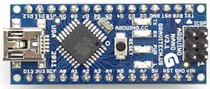
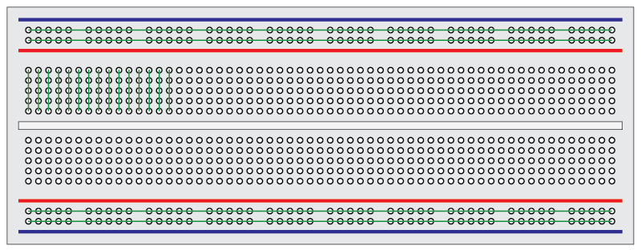
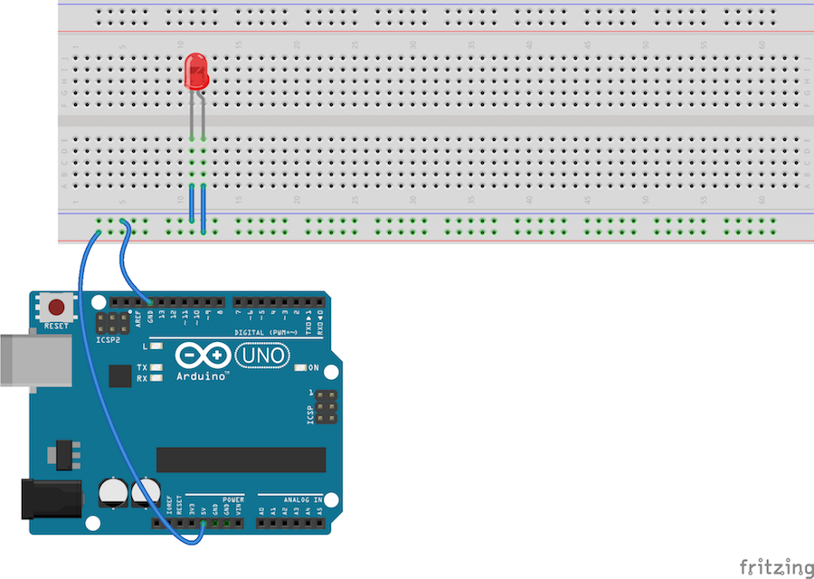
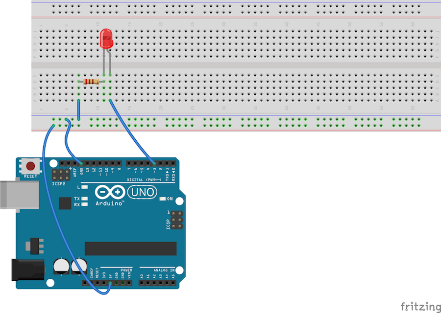
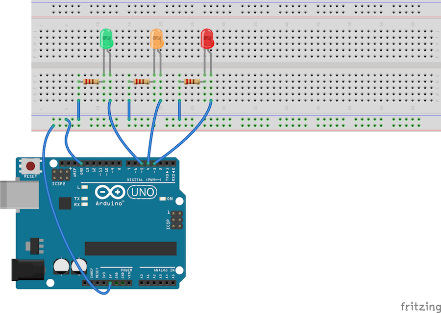

# Prvi koraki

## Diode in testne plošče

LED dioda je kot majhna žarnica. Kot vsako žarnico jo moramo vključiti v električni krog, tako elektrika teče "skoznjo". Če imamo pred sabo baterijo: žarnico priključimo jo na `+` in `-`, pa bo elektrika tekla iz pozitivnega pola baterije skozi žarnico in v negativnega. (V tem besedilu si bomo privoščili napisati marsikaj, ob čemer bi se fiziki ali elektrotehniki križali. Tole je že bila ena takšnih reči. Tule se jim enkrat za vselej opravičujemo in odslej se bomo na pravorečje požvižgali.)

LED se od običajnih žarnic razlikuje (tudi) po tem, da ni vseeno, kako jo obrnemo. Če pozorno pogledamo njeni nožici, vidimo, da je ena krajša in na to moramo pripeljati minus. To si bomo preprosto zapomnili: *minus je tista, ki so jo odrezali*. Če imaš pri roki kako baterijo ali kaj podobnega z napetostjo med 3 in 5 volti, lahko poskusiš nanjo priključiti diodo in če jo boš pravilno obrnil, bo svetila, sicer pa ne.

Namesto baterije lahko uporabimo tudi Arduina. Na zgornji in spodnji strani (če ga gledamo obrnjenega, kot je na sliki) ima kup "luknjic", ki jim pravimo "pini". (Pin je po angleško "igla". Zakaj bi luknjicam pravili iglice? Različni tovrstni računalniki imajo v resnici iglice; Arduino ima luknje, a ker je njihova vloga enaka vlogi iglic na drugih, uporabljamo kar ime "iglice". Se pravi pini.)

Tvoj Arduino morda ne izgleda popolnoma enako, čeprav je ravno tako Arduino Uno. Če imaš katerega drugega, recimo simpatičnega malega Arduino Nano, je lahko tudi popolnoma drugačen, oznake pinov pa bodo enake, tako da boš lahko besedilu brez težav sledil tudi z njim. (Razen v naslednjem delčku besedila. Nano ima v resnici iglice, ne luknjic, zato bi vanj še nekoliko težje vtaknil diodo.)

Na Arduinove pine bomo priklapljali različne stvari. Da nanj priključimo LED, bomo potrebovali dva: enega, na katerem piše `GND` (takih je več - izbereš lahko kateregakoli) in enega, ob katerem piše `+5V`.

V elektroniki "polov" navadno ne označujemo z `+` in `-`, pozitivnim in negativnim. Pač pa negativnemu rečemo ničla ali *zemlja* (ali, v angleščini *ground*, od koder torej okrajšava `GND`). Pri pozitivnem pa dopišemo napetost - zato `+5V`.

Diodo bomo priključili tako, da bomo potisnili krajšo nožico v pin z oznako `GND` in daljšo v `+5V`. Ne gre, ker dioda ne more narediti špage? Drži. Še bolj ne bo šlo, ko bomo malo kasneje izvedeli, da je potrebno vmes dodati še upornik.

Zato vzemimo v roke še eno čudo: testno ploščo. Z njo bomo sestavljali testna vezja. V plošči je kup luknjic, v katere zatikamo žičke. Znotraj plošče so luknjice povezane: po dve vrstici ob daljših robovih so povezane vzdolž roba, stolpci pa so povezani poprek. Tale razlaga najbrž ni prav razumljiva, iz slike pa bo vse jasno:

Plošče se med seboj nekoliko razlikujejo, na večini pa tečejo povezave, kot nakazujejo zelene črte na sliki. Pazi le na tole: če sta morda in rdeča črta na tvoji testni plošči na sredi prekinjeni, je v resnici prekinjena tudi povezava med levo in desno skupino luknjic na zgornjem in spodnjem robu.

Zdaj Arduinov pin `GND` povežimo z modro vrstico na testni plošči in `+5V` z rdečo. **Pazi** tole je zelo pomembno. Pozorno poglej sliko, saj se ne smeš zmotiti: `GND` gre v eno vrstico, `+5V` pa v drugo. Če ju vtakneš v isto, lahko pokvariš Arduina. V vezjih, ki jih bomo sestavljali, bomo morda večkrat potrebovali `GND` in `+5V`, in zdaj smo si ga "namnožili": vsi pini ob robovih zdaj "ponujajo" `GND` in `+5V`.

Diodo vstavimo tako da bo ena nožica v enem, druga v drugem stolpcu. Z dodatnima žicama pripeljemo `GND` in `+5` V v tadva stolpca in - dioda sveti. Če je posvetila, jo **takoj** potegni spet ven; boš še izvedel, zakaj.

Če noče, preveri

- ali je pravilno obrnjena,
- ali si Arduino priključil prek USB na računalnik in je torej prižgan (da je, bo pokazal tako, da bo na njem svetila kaka lučka),
- ali dioda deluje (zamenjaj jo z drugo),
- ali uporabljaš prave pine na Arduinu.

Recimo, da ti je uspelo in dioda sveti. Zdaj pa jo hitro potegni ven.

## Uporniki

Čim več stvari poskusimo, tem pametnejši smo. So pa stvari, ki jih ni pametno preskusiti. Eden od poskusov, ki jih ne priporočam, je vtikanje žarnice iz žepne svetilke v stensko vtičnico. (Recimo, da so na žarnico priključene žice in bi to načelno lahko izvedli.) Najmanj, kar se bo zgodilo, je, da bo pošteno počilo, možni pa so tudi pretresljivejši rezultati. (Resno, tega **nikoli** ne naredi, saj te elektrika lahko ubije!) Take majhne žarničke pač niso narejene za 230 V napetosti.

Tudi diode same ne smejo biti vezane v električne kroge. Dodati jim moramo upornike. Za upornike si lahko predstavljamo, da "zavirajo" elektriko. Elektriko moramo torej prisiliti, da teče prek diode in še prek upornika.

Uporniki so prepoznavne zadeve. Gre za majhne "valjčke", na katerih so narisani pisani trakci. Upornost (količino, ki pove, kako močno upornik zavira elektriko) merimo v ohmih, po nemškem fiziku Ohmu. (Temu se reče enakopravnost: Volti so imenovani po Italijanu Volti, watti po Angležu Wattu in amperi po Francozu Amperu. Predstavljajte si, da bi se z napetostmi ukvarjal Janez Novak in bi v vtičnicah namesto 230 voltov imeli 230 novakov.) Barve trakcev povedo, za kakšen upornik gre. Ker barv ne znamo brati, si bomo pomagali s tem, kar piše na škatli, v katerih imamo spravljene upornike: uporniki, ki jih bomo uporabljali ob diodah, naj imajo približno 150 ohmov.

**Naloga 1.1** Tako smo prišli do prve naloge: zatakni v testno ploščo upornik in diodo ter poveži tako, da bo elektrika tekla od `+5V` skozi diodo, skozi upornik in naprej v `GND`.

Na koncu vsakega "poglavja" so namigi za reševanje nalog in za njimi rešitev. Nalogo najprej poskusi rešiti sam, saj se boš tako največ naučil. Če ne gre, poskusi z namigom. Če res res res ne gre drugače, pa poglej rešitev.

Ko je naloga rešena, pa si le oglej še objavljeno rešitev. Morda je boljša od tvoje - morda pa si se spomnil boljše ti.

## Prvi program

Obstajajo tudi zanimivejše reči od diod, ki stalno svetijo. Recimo diode, ki utripajo. Tu imamo problem: da bi dioda utripala, bi jo bilo potrebno stalno vklapljati in izklapljati, česar seveda ne bomo počeli. Lahko pa jo prključimo na kak pin, ki ni tako dolgočasen kot `+5V`, ki vedno daje napetost. Recimo na kakega, ki ga lahko kontroliramo s programom. Izberimo, recimo, `D3` (oziroma številko `3` na pinih, ki so označeni z besedo `DIGITAL`). Namesto na `+5V` in `GND` naj bo dioda torej priključena na `D3` in `GND`.

Sveti? Ne sveti? Ne vem. Na `D3` je bodisi nič (kot na `GND`; temu rečemo, da je pin v stanju `LOW`) ali +5 V (temu rečemo, da je `HIGH`). Kaj bo na `D3`, določamo s programom. Tega pa moramo napisati.

Zdaj poženemo okolje za pisanje programov v Arduinu. Imenuje se Arduino. (Če ga na računalniku še ni, ga boš našel na [spletni strani Arduina](https://www.arduino.cc/en/Main/Software)).

Pojavi se okno s praznim programom.

    void setup() {
      // Nekaj besedila, ki ne naredi ničesar, saj se vse, kar...

    }

    void loop() {
      // ...zapišemo za dvema poševnicama, ignorira. Sem pišemo opazke zase.

    }

Čemu `void` in čemu vsi ti oklepaji, bomo izvedeli kasneje, sproti. Za zdaj je potrebno vedeti, da znotraj zavitih oklepajev (`{` in `}`, ne `(` in `)`) pri `setup` napišemo, kaj naj Arduino stori, ko ga prižgemo (ali ko mu pošljemo program), znotraj tistih pri `loop` pa, kaj naj potem stalno počne, dokler ga ne ugasnemo ali pa mu pošljemo kak drug program.

Ta program očitno najprej ne naredi ničesar (ker je `setup` prazen) in potem ponavlja nič (ker je prazen tudi `loop`). Spremenili ga bomo tako, da bo v začetku, ko se začne izvajati, prižgal LEDico, ki je pripeta na pin `3`. Za to je potrebno storiti dvoje. Najprej moramo Arduinu naročiti, naj bo pin `3` izhodni. Pine lahko namreč uporabljamo za vhod ali izhod. Na izhode pripnemo diode, motorje, zvočnike, skratka stvari, ki jim lahko Arduino sporoči (zato *izhod*, saj gre to *ven* iz Arduina), naj svetijo, se vrtijo in piskajo. Na vhode priklapljamo senzorje, mikrofone, tipke in podobne stvari, ki Arduinu (zato *vhod*, saj gre noter, v Arduina) povedo, ali kaj vidijo, slišijo, ali pa jih kaj tišči.

Naj bo pin 3 namenjen izhodu, določimo tako, da napišemo

    pinMode(3, OUTPUT);

Temu `pinMode` bomo rekli ukaz. (Uradno se temu reče "funkcija", a to nas ne bo vznemirjalo.) Arduino ima veliko različnih ukazov (da ne govorimo o tem, da lahko sestavljamo še svoje). Ukazi imajo lahko "argumente", nekakšne dodatne podatke. Te zapišemo v oklepaje za ukazom. Z ukazom `pinMode` torej Arduino povemo, kakšno vlogo ima določen pin. Ukaz ima dva argumenta, prvi je številka pina, drugi je vloga. Vloga je lahko `OUTPUT` ali `INPUT`; tule hočemo `OUTPUT`, zato torej

    pinMode(3, OUTPUT);

Večina programskih jezikov je občutljiva na male in velike črke. Tudi Arduinov je takšen. Besedo `pinMode` je potrebno napisati tako, da napišemo `M` z veliko črko, ostale pa so male. Če namesto tega napišete `pinmode` ali `PinMode` ali `PINmODE`, Arduino tega ukaza ne bo prepoznal.

Na konec vsakega ukaza moramo dati podpičje. Če ga pozabimo, se bo program, ki spravi naš program na Arduino, pritožil, da je z našim programom nekaj narobe. Enako se bo zgodilo, če pozabimo kakšen oklepaj, uporabimo ukaz, ki ne obstaja ali kaj podobnega. Tole bo v začetku malo najedalo - teh napak bo veliko in sporočil o njih ne bomo vedno razumeli. Ko se človek malo izuri, pa dela vedno manj takšnih napak, pa tudi sporočila o njih vedno boljše razume in jih zato vedno hitreje popravlja.

Zdaj na ta pin nekaj "zapišimo". Ukaz za to se imenuje `digitalWrite`. Tudi ta ima dva argumenta; prvi pove, na kateri pin pišemo, drugi pa, *kaj* pišemo. Ta "*kaj*" je lahko `LOW` ali `HIGH`. Če je `HIGH`, bo dioda bo svetila. Če `LOW` bo ugasnila.

Vse skupaj je torej videti takole: 

    void setup() {
        pinMode(3, OUTPUT);
        digitalWrite(3, HIGH);
    }

    void loop() {
    }

V `setup`, torej v začetku izvajanja programa, se izvedeta ukaza, ki povesta, da je pin 3 namenjen izhodu in da naj se na ta izhod zapiše `HIGH`.

V `loop` ni ničesar. Arduino bo torej le prižgal diodo, potem pa ...nič več.

Opazujte, kako oblikujemo program: vse, kar je znotraj `setup` in `loop` smo umaknili za štiri presledke, da je očitno, da je to "znotraj". To bo postalo posebej pomembno kasneje, ko bodo naši programi daljši in bi bili brez zamikanja nepregledni.

Preden spravimo program na Arduina, moramo povedati, kakšnega Arduina imamo. V menuju *Tools* pogledamo pod *Board* in če imamo, recimo Arduino Uno, izberemo tega. Nato v menuju *Tools* izberemo *Port* in poiščemo tisto izbiro, pod katero se pojavi naš Arduino Uno. Če ga ne vidimo nikjer in se pokaže le, recimo COM1 in COM4, pač poskušamo srečo.

Zdaj kliknemo na ikono s puščico v orodni vrstici zgoraj. Računalnik bo spremenil (učeno se temu reče *prevedel*) naš program v obliko, v kateri ga lahko razume in izvaja Arduino, ter ga prek kabla USB prenesel na Arduina, kjer se bo program takoj začel izvajati. Kako napreduje "prevajanje" programa in prenašanje, izvemo v spodnjem delu okna. S tem, kar se izpisuje tam, se nam ni potrebno ukvarjati - razen, kadar v programu naredimo takšno napako, da ga računalnik ne razume. V tem primeru nam bo spodaj izpisal, kaj ga moti, mesto z napako pa označil z rdečo.

Če torej v programu nismo česa pozabili, ga bo okolje preneslo na Arduino, ta ga bo začel "izvajati" in dioda bo zasvetila (če ni svetila že prej).

## Prižgi in ugasni

Naslednji izziv je LED po prižiganju še ugasniti.

    void setup() {
        pinMode(3, OUTPUT);
        digitalWrite(3, HIGH);
        digitalWrite(3, LOW);
    }

    void loop() {
    }

Za program ne moremo reči, da ne deluje. Pravzaprav moramo reči, da deluje in to celo zelo hitro. Tako hitro, da najbrž niti ne opazimo, da se je dioda prižgala. Če hočemo kaj videti, moramo med prižiganje in ugašanje dodati malo pavze. Temu služi ukaz `delay`. Argument je tokrat le eden, namreč čas čakanja v milisekundah. Če hočemo, da program počaka eno sekundo, bomo na mestu, kjer mora počakati, napisali `delay(1000)`.

    void setup() {
        pinMode(3, OUTPUT);
        digitalWrite(3, HIGH);
        delay(1000);
        digitalWrite(3, LOW);
    }

    void loop() {
    }

Spet pritisnemo puščico, program se prenese na Arduino, dioda se prižge in sekundo kasneje ugasne. Če hočemo, da se to ponovi, bodisi ponovno prenesemo program, ali pa ponovno zaženemo Arduino, tako da pritisnemo tipko "reset" - edino tipko, ki jo ima.

## Utripanje

Naslednji korak je jasen: dioda naj utripa. Za to bomo uporabili `loop`. V `setup` bomo povedali le, naj pin 3 služi kot izhod, v `loop` pa bomo prižgali diodo, počakali sekundo, ugasnili diodo in počakali sekundo.

Takole?

    void setup() {
        pinMode(3, OUTPUT);
    }

    void loop() {
        digitalWrite(3, HIGH);
        delay(1000);
        digitalWrite(3, LOW);
    }

Deluje? Se dioda prižiga in ugaša?

Tudi meni se je zdelo, da ne bo šlo. Razmisli, zakaj - in popravi.

**Naloga 1.2.** Popravi zadnji program, ki smo ga napisali, tako da bo dioda utripala.

**Naloga 1.3.** Vzemi dve diodi, po možnosti rdeči. Priključi ju na dva različna pina, recimo 3 in 4, ter poskrbi, da bosta utripali kot luči ob spuščeni zapornici na železniškem prehodu. Vedno naj sveti ena ali druga dioda; nikoli obe in nikoli nobena. Pazi: kadar priklapljaš več diod, potrebuje vsaka svoj upornik.

**Naloga 1.4.** Vzemi tri diode, po možnosti rdečo, oranžno (ali rumeno) in zeleno, ter sprogramiraj semafor.

**Naloga 1.5.** Na semaforjih je včasih zelena luč trikrat utripnila, preden je ugasnila. V svoj zadnji program dodaj še to.

# Namigi

#### Naloga 1.1 Dioda in upornik

Razmisli, kako bo tekla elektrika. Predstavljaj si, da so žice cevi, po katerih moraš speljati vodo iz `+5V` prek upornika in diode (ali prek diode in upornika) do `GND`.

# Rešitve

#### Naloga 1.1 Dioda in upornik

Tole seveda ni edina možna rešitev. Lepo pa je, da se navadiš pripeljati `+5V` na rdečo vrstico in `GND` na modro. Ko bo povezav več, se boš brez takšnih pravil hitro izgubil.

#### Naloga 1.2. Utripajoča dioda

Napaka je v tem, da med ugašanjem in prižiganjem ni pavze. Dioda se namreč prižge takoj potem, ko se je ugasnila, saj se vse, kar napišemo v `loop`, stalno ponavlja. Pravilni program je zato 

    void setup() {
        pinMode(3, OUTPUT);
    }

    void loop() {
        digitalWrite(3, HIGH);
        delay(1000);
        digitalWrite(3, LOW);
        delay(1000);
    }

#### Naloga 1.3. Dve rdeči luči

Kako priključiti diode, si poglej v rešitvi naslednje naloge. Razlika med naslednjo in to je le v tem, da imamo tu le dve diodi in da sta obe rdeči.

Program napišemo tako, da takrat, ko prižge eno diodo, ugasne drugo in obratno. Poleg tega ne smemo pozabiti nastaviti `pinMode` za obe diodi. Mimogrede še malo pospešimo hitrost utripanja tako, da skrajšamo čakanje med njima na pol sekunde (500 ms).

    void setup() {
        pinMode(3, OUTPUT);
        pinMode(4, OUTPUT);
    }

    void loop() {
        digitalWrite(3, HIGH);
        digitalWrite(4, LOW);
        delay(500);
        digitalWrite(3, LOW);
        digitalWrite(4, HIGH);
        delay(500);
    }
    
#### Naloga 1.4. Semafor

Vezje je takšno.

Ne spreglej, da ima vsaka dioda svoj upor. Na vse upore pripeljemo GND iz modre vrstice. 5 V pa dobi vsaka dioda iz svojega pina. Dali smo jih na pine 3 (rdeča), 4 (oranžna) in 5 (zelena). Seveda bi se lahko odločili tudi drugače.

Tu pa je program.

    void setup() {
        pinMode(3, OUTPUT);
        pinMode(4, OUTPUT);
        pinMode(5, OUTPUT);
        digitalWrite(3, LOW);
        digitalWrite(4, LOW);
        digitalWrite(5, LOW);
    }

    void loop() {
        // rdeca luc
        digitalWrite(3, HIGH);
        delay(4000);
        digitalWrite(3, LOW);

        // rumena luc
        digitalWrite(4, HIGH);
        delay(1000);
        digitalWrite(4, LOW);

        // zelena luc
        digitalWrite(5, HIGH);
        delay(6000);
        digitalWrite(5, LOW);
    }

V `setup` smo ugasnili vse tri luči. To naredimo za vsak slučaj, ker ne moremo biti popolnoma prepričani, v kakšnem stanju bodo v začetku.

Kar je zapisano za dvojnimi poševnicami, je namenjeno le nam. Računalnik to preskoči, nam pa pomaga, da se hitreje znajdemo v programu.

#### Naloga 1.5. Semafor z utripajočo zeleno lučjo

Program moramo dopolniti tako da, za ugašanjem zelene luči malo počakamo, prižgemo luč, malo počakamo in jo spet ugasnemo, takole

        delay(300);
        digitalWrite(5, HIGH); // prvi utrip
        delay(500);
        digitalWrite(5, LOW);

To bomo ponovili trikrat. Celoten program je tako

    void setup() {
        pinMode(3, OUTPUT);
        pinMode(4, OUTPUT);
        pinMode(5, OUTPUT);
        digitalWrite(3, LOW);
        digitalWrite(4, LOW);
        digitalWrite(5, LOW);
    }

    void loop() {
        // rdeca luc
        digitalWrite(3, HIGH);
        delay(4000);
        digitalWrite(3, LOW);

        // rumena luc
        digitalWrite(4, HIGH);
        delay(1000);
        digitalWrite(4, LOW);

        // zelena luc
        digitalWrite(5, HIGH);
        delay(6000);
        digitalWrite(5, LOW);
        delay(300);
        digitalWrite(5, HIGH); // prvi utrip
        delay(500);
        digitalWrite(5, LOW);
        delay(300);
        digitalWrite(5, HIGH); // drugi
        delay(500);
        digitalWrite(5, LOW);
        delay(300);
        digitalWrite(5, HIGH); // tretji
        delay(500);
        digitalWrite(5, LOW);
    }

V programu smo se malo igrali s časi. Razmisli, kaj sveti na semaforju v času posameznega ukaza `delay`.
