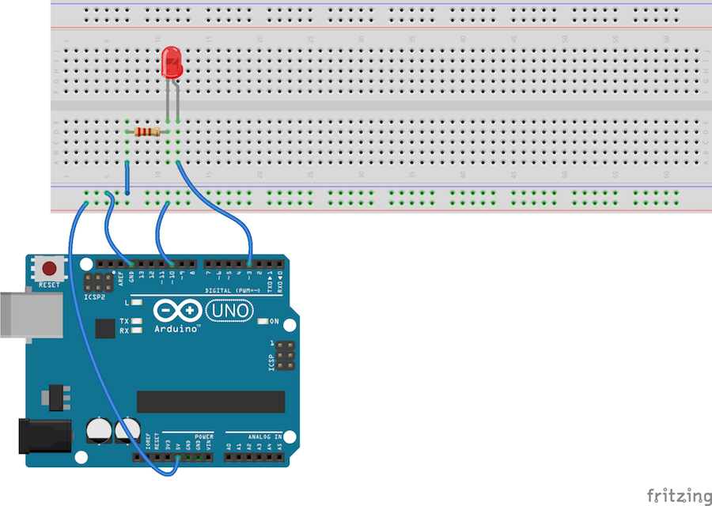
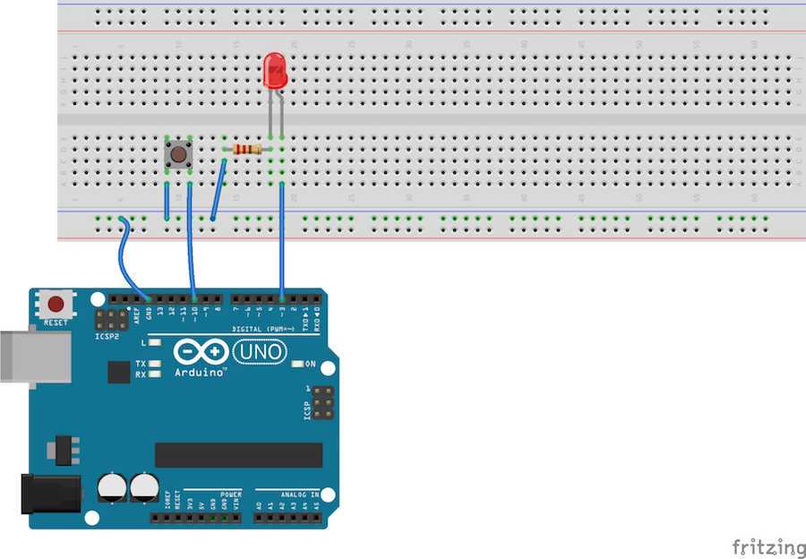

# Tipke in pogoji

Za začetek bomo sestavili povsem preprosto vezje s tipko. Če imaš še vedno pripravljeno vezje s sedmimi diodami in nimaš posebne ploščice z njimi, temveč si jih povezal na testni plošči, ne razdiraj vezja, saj ga boš kmalu spet potreboval. Kar bomo vezali, preden se vrnemo k sedmim diodam, sestavljaj na kakem prostem delu plošče.

## Branje s pinov

Če moramo napisati `pinMode(3, OUTPUT)`, da povemo, da bomo na pin `D3` pisali, potem si lahko mislimo, da najbrž obstaja tudi `pinMode(3, INPUT)`.

Drži, obstaja. In poleg `digitalWrite` obstaja tudi `digitalRead`. Z `digitalWrite(3, HIGH)` smo Arduino ukazali, naj nastavi napetost na pinu `D3` na 5 voltov (in dioda je svetila), z `digitalWrite(3, LOW)` smo jo spustili na 0 V ("na zemljo") in dioda je ugasnila. Z `digitalRead(3)` preverimo, kakšna je napetost na pinu `D3`.

To lahko uporabimo, recimo, v pogoju. Sestavi takšnole vezje.

In takšen program.

    void setup() {
        pinMode(3, OUTPUT);
        pinMode(10, INPUT);

        while (digitalRead(10) == HIGH) {
            digitalWrite(3, HIGH);
        }
        digitalWrite(3, LOW);
    }

    void loop() {
    }

Dvojni enačaj uporabljamo za primerjanje: pogoj v zanki pravi, *dokler je tisto, kar preberemo na pinu 10, enako HIGH*. Enojni enačaj namreč uporabljamo za prirejanje vrednost (kot v `i = 3;`), zato za primerjanje uporabljamo dvojnega. Da se loči.

Program pove, da bo pisal na pin 3 in bral s pina 10. V zanki bere stanje na pinu 10. Ker je ta priključen na rdečo vrstico, ki je povezana z `+5V`, je stanje `HIGH` in zanka se nikoli ne konča. Zdaj pa kar medtem, ko program teče, žico, ki gre na pin 10, iztaknili iz rdeče vrstice in jo vtaknemo v modro. S tem spustimo stanje iz `HIGH` v `LOW`, zanka se konča in program ukasne diodo na pinu 3. Ker je `loop` prazen, se potem ne zgodi nič več.

Če hočemo videti predstavo ponovno, spet pretaknemo žico v modro vrstico in na Arduino pritisnemo tipko Reset.

Program lahko nekoliko skrajšamo. Nobene potrebe ni, da bi z `digitalWrite(3, HIGH)` vedno znova prižigali že prižgano diodo. To lahko naredimo pred zanko.

    void setup() {
        pinMode(3, OUTPUT);
        pinMode(10, INPUT);

        digitalWrite(3, HIGH);
        while (digitalRead(10) == HIGH) {
        }
        digitalWrite(3, LOW);
    }

    void loop() {
    }

Zanka je zdaj hecno prazna. A tako je čisto prav. Dokler ne pretaknemo žice, naj program ne počne ničesar. Zato med zavita oklepaja ne napišemo ničesar. To bomo pisali še krajše, tako

    void setup() {
        pinMode(3, OUTPUT);
        pinMode(10, INPUT);

        digitalWrite(3, HIGH);
        while (digitalRead(10) == HIGH) {}
        digitalWrite(3, LOW);
    }

    void loop() {
    }

## Tipka

Pretikanje žic ni praktično. Boljše je imeti stikala ali tipke. Vendar žal nimamo pri roki takšnih, s katerimi bi lahko preklapljali med dvema žicama, temveč le takšne, ki povežejo dva stolpca, ko pritisnemo tipko.

Tule je vezje.

Povezavo s `+5V` smo kar ukinili, saj je ne potrebujemo. Tipka je nasajena čez dva stolpca. Stolpec vmes je prost. V en stolpec smo pripeljali `GND`, drugi stolpec je povezan z `D10`. Ko pritisnemo na tipko, bo `D10` torej povezan z `GND` in `digitalRead(10)` bo prebral `LOW`.

Kaj pa, ko tipka ni pritisnjena? Kakšno je stanje `D10` tedaj? Nihče ne ve. Kadar je pin "v zraku" lahko z njega preberemo karkoli. V resnici bi včasih prebrali `LOW` in včasih `HIGH`. Težavo rešimo z malenkost drugačnim programom.

    void setup() {
        pinMode(3, OUTPUT);
        pinMode(10, INPUT_PULLUP);

        digitalWrite(3, HIGH);
        while (digitalRead(10) == HIGH) {}
        digitalWrite(3, LOW);
    }

    void loop() {
    }

`INPUT` smo zamenjali z `INPUT_PULLUP`. V angleščini *pull up* pomeni "vleči gor". Arduino bo poskrbel, da bo pin 10 `HIGH`, razen kadar ga bomo z vezjem zvlekli "dol", v `LOW`.

Zdaj pa le sestavi to vezje in preskusi program!

**Naloga 3.1** Spremeni program tako, da bo dioda svetila, dokler je tipka pritisnjena. Da boš kaj videl, moraš že takrat, ko ga poženeš, tiščati tipko. Ko jo boš spustil, naj dioda ugasne.

**Naloga 3.2** Vrni se k sedmim diodam in programu, v katerem se diode hitro prižigajo od leve proti desni in nazaj. Spremeni ga tako, da se bo, kadar je tipka pritisnjena, ustavil. Ustavi naj se v trenutku, ko je neka dioda prižgana in ne ravno takrat, ko so vse ugasnjene. Če diode dovolj hitro begajo levo in desno, lahko program uporabiš namesto igralne kocke (no, kocke s sedmimi ploskvami): igralec "vrže" 1, če sveti prva dioda, 2, če druga...

## Pogoji

V programih znamo reči "ponavljaj dokler". Napisati znamo *dokler je `i` manjši od 9* (`while (i < 9)`), *dokler je pritisnjena tipka* (`while (digitalRead(10) == LOW)`) in podobno. Kaj pa, kadar nočemo ponavljati, temveč bi radi nekaj storili *če je pritisnjena tipka*? In kaj drugega, če ni pritisnjena?

*Če* je po angleško `if`, *sicer* pa `else`. V programu ju uporabljamo takole.

    void setup() {
        pinMode(3, OUTPUT);
        pinMode(10, INPUT_PULLUP);
    }

    void loop() {
        if (digitalRead(10) == LOW) {
            digitalWrite(3, HIGH);
        }
        else {
            digitalWrite(3, LOW);
        }
    }

`if` je zelo podoben `while`. Besedi `if` sledi v oklepaje zaprt pogoj, nato pa v zavitih oklepajih naštejemo vse, kar naj se zgodi, če je pogoj izpolnjen. Ko zapremo zavite oklepaje, lahko dodamo `else` in za njim v zavitih oklepajih povemo, kaj naj se zgodi, če pogoj ni izpolnjen. Drugi del, `else` in ukaze za njim, smemo tudi izpustiti; v tem primeru se v primeru, da pogoj ni izpolnjen, pač ne bo zgodilo nič.

**Naloga 3.3** Odkrij, kaj dela ta program. Vezje naj bo kar takšno, kot si ga naredil nazadnje.

**Naloga 3.4** Spet vzemi program, v katerem diode "potujejo" levo in desno. Pomeči ven vrstice, s katerimi si poskrbel, da tipka ustavi premikanje. Zdaj pa naredi tako: če je pritisnjena tipka, naj bo premikanje počasnejše, kot če ni.

**Naloga 3.5** Preskusi tale program. Kaj deluje? Kako deluje? Zakaj deluje? Kaj počne `if` na koncu? (Da te ne bo zmedlo: ne, v tem programu ni tipke.)

    void setup() {
        int i = 3;
        while (i <= 9) {
            pinMode(i, OUTPUT);
            i++;
        }
    }

    void loop() {
        int i = 3;
        while (1 + 1 == 2) {
            digitalWrite(i, HIGH);
            delay(200);
            digitalWrite(i, LOW);
            i++;
            if (i == 10) {
                i = 3;
            }
        }
    }

**Naloga 3.6** Spremeni program iz prejšnje naloge, tako da se bodo diode prižigale v nasprotno smer.

**Naloga 3.7** Čas je, da spet vključimo tipko. Združili bomo zadnji dve nalogi: če je tipka pritisnjena, gremo v eno smer, sicer v drugo.

# Namigi

#### Naloga 3.1. Dokler je tipka pritisnjena

V programu moraš le spremeniti pogoj, ki govori o tem, doklej naj program ne dela ničesar.

#### Naloga 3.2. Žrebanje

Saj veš, kako ustaviti program: na primerno mesto napišeš oni `while`, v katerem ni ničesar med zavitimi oklepaji. Na katero mesto ga boš dal?

Pri sestavljanju tega programa se pogosto zmotimo tako, da so, ko pritisnemo stikalo, vse diode ugasnjene. Če se to dogaja tudi tebi, ponovno pomisli, na katero mesto postaviti oni slavni `while`, ki ne dela ničesar.

Ne znaš sestaviti vezja? Povezave s tipko so enake kot smo jih narisali v začetku: tipka je povezana z `GND` in `D10`. Razlika je le v tem, da ne priključimo ene diode temveč sedem diod, tako kot smo to počeli v prejšnjem delu.

#### Naloga 3.3 Kaj dela?

Za tole ne potrebuješ namiga. Prepiši program in ga preskusi, ne?

#### Naloga 3.4 Hitreje in počasneje

Pavza med prižiganjem diod je odvisna od ukaza `delay`. Če (namig: *če*) je pritisnjena tipka, naj bo pavza daljša, če ni, pa krajša.

#### Naloga 3.5: Kaj dela (2)?

Ena in ena je vedno dve. Vedno. Kaj to pomeni za zanko, ki se izvaja, dokler je pogoj izpolnjen?

Vrednost `i` povečujemo od 3 do ... Hm, kaj se zgodi, ko pride do 10?

#### Naloga 3.6: V drugo smer

Namesto, da povečaš `i`, ga moraš zmanjšati.

Moral boš tudi premisliti, kakšna naj bo njegova začetna vrednost (`3` bo sicer verjetno v redu), predvsem pa moraš primerno popraviti pogoj v `if` in tisto, kar je znotraj njega.

#### Naloga 3.7: Sem ali tja

Misliš, da potrebuješ dve zanki? Ne. Še vedno bo le ena. Pač pa boš potreboval `if`, ki bo, **če** je tipka pritisnjena, povečal `i`, **sicer** pa ga bo zmanjšal.

Paziti boš moral tudi na obe meji - kaj storiti, če je `i` prilezel do `10` in kaj če je padel na `2`.

# Rešitve

#### Naloga 3.1. Dokler je tipka pritisnjena

Ko je tipka pritisnjena, je `digitalRead(10)` enak `LOW`. Če hočemo, da program čaka, dokler je pritisnjena, torej potrebujemo `while (digitalRead(10) == LOW) {}` namesto `while (digitalRead(10) == HIGH) {}`.

    void setup() {
        pinMode(3, OUTPUT);
        pinMode(10, INPUT_PULLUP);

        digitalWrite(3, HIGH);
        while (digitalRead(10) == LOW) {}
        digitalWrite(3, LOW);
    }

    void loop() {
    }

#### Naloga 3.2. Žrebanje

Zanko `while`, ki ustavi program, postavimo med `digitalWrite(i, HIGH);` in `digitalWrite(i, LOW);`. Lahko je pred ali za `delay`. Postavimo ga v obe zanki, tisto, ki teče v desno in ono, ki gre v levo.

    void setup() {
        int i = 3;
        while (i <= 9) {
            pinMode(i, OUTPUT);
            i++;
        }
        pinMode(10, INPUT_PULLUP);
    }

    void loop() {
        int i = 3;
        while (i <= 9) {
            digitalWrite(i, HIGH);
            delay(20);
            while (digitalRead(10) == LOW) {}
            digitalWrite(i, LOW);
            i++;
        }

        i = 8;
        while (i >= 3) {
            digitalWrite(i, HIGH);
            delay(20);
            while (digitalRead(10) == LOW) {}
            digitalWrite(i, LOW);
            i--;
        }
    }

#### Naloga 3.3. Kaj dela?

Če je tipka pritisnjena, prižgemo diodo, sicer jo ugasnemo.

#### Naloga 3.4. Hitreje in počasneje

Ukaz `delay(20)` (ali kolikor že) moramo zamenjati z

            if (digitalRead(10) == LOW) {
                delay(100);
            }
            else {
                delay(20);
            }

Tako dobimo.

    void setup() {
        int i = 3;
        while (i <= 9) {
            pinMode(i, OUTPUT);
            i++;
        }
        pinMode(10, INPUT_PULLUP);
    }

    void loop() {
        int i = 3;
        while (i <= 9) {
            digitalWrite(i, HIGH);
            if (digitalRead(10) == LOW) {
                delay(100);
            }
            else {
                delay(20);
            }
            digitalWrite(i, LOW);
            i++;
        }

        i = 8;
        while (i >= 3) {
            digitalWrite(i, HIGH);
            if (digitalRead(10) == LOW) {
                delay(100);
            }
            else {
                delay(20);
            }
            digitalWrite(i, LOW);
            i--;
        }
    }

#### Naloga 3.5. Kaj dela (2)?

Zanka se izvaja za vse večne čase ali dokler ne zmanjka elektrike ali dokler ne ugasnemo Arduina ali dokler mu ne damo drugega programa.

Zanka povečuje `i` od 3 do 10. Ko se poveča na 10, ga takoj spremenimo nazaj na 3, saj na pinu 10 ni diode. Poleg tega v zanki prižgemo in ugasnemo diodo na pinu `i`. Torej bo program po vrsti prižigal diode, vendar ne na levo in na desno, temveč vedno le v eno smer.

#### Naloga 3.6. V drugo smer

Začetna vrednost `i = 3;` bo čisto v redu. Pravzaprav bi lahko napisali tudi `i = 9;` ali karkoli vmes. Bolj pomemben je pogoj. V prejšnjem programu smo morali `i`, ko je prišel do `i == 10`, spremeniti nazaj v `i = 3;`. Tu pa ravno obratno. Ko pridemo do `i == 2`, postavimo `i` na `9`.

Seveda ne smemo pozabiti spremeni `i++;` v `i--;`.

    void setup() {
        int i = 3;
        while (i <= 9) {
            pinMode(i, OUTPUT);
            i++;
        }
    }

    void loop() {
        int i = 3;
        while (1 + 1 == 2) {
            digitalWrite(i, HIGH);
            delay(200);
            digitalWrite(i, LOW);
            i--;
            if (i == 2) {
                i = 9;
            }
        }
    }

#### Naloga 3.7. Sem ali tja

Z `if (digitalRead(10) == LOW)` se odločamo med `i--;` in `i++;`.

Na konec pa dodamo oba pogoja iz prejšnjih nalog.

    void setup() {
        int i = 3;
        while (i <= 9) {
            pinMode(i, OUTPUT);
            i++;
        }
    }

    void loop() {
        int i = 3;
        while (1 + 1 == 2) {
            digitalWrite(i, HIGH);
            delay(200);
            digitalWrite(i, LOW);
            if (digitalRead(10) == LOW) {
                i--;
            }
            else {
                i++;
            }
            if (i == 2) {
                i = 9;
            }
            if (i == 10) {
                i = 3;
            }
        }
    }

Še o nečem lahko razmislimo. `i` lahko pride do 2 le, če smo ga ravnokar zmanjšali, in do 10 le, če smo ga ravnokar povečali. Program lahko preobrnemo tudi tako.

    void setup() {
        int i = 3;
        while (i <= 9) {
            pinMode(i, OUTPUT);
            i++;
        }
    }

    void loop() {
        int i = 3;
        while (1 + 1 == 2) {
            digitalWrite(i, HIGH);
            delay(200);
            digitalWrite(i, LOW);
            if (digitalRead(10) == LOW) {
                i--;
                if (i == 2) {
                    i = 9;
                }
            }
            else {
                i++;
                if (i == 10) {
                    i = 3;
                }
            }
        }
    }

Imamo torej pogoj znotraj pogoja: pogoj `if (i == 2)` se preverja le, če je bilo res drži, da je `if (digitalRead(10) == LOW)`. Ali se je `i` zmanjšal na `2`, je smiselno gledati le, če je tipka pritisnjena.

Če pogledamo vse skupaj: imamo zanko `while`, znotraj njega pogoj `if` in znotraj `if`-a še en `if`. Kar zapleteno, ne? A če razumemo posamezne kose programa, razumemo tudi, kaj počne celoten program, ne?

Se spomniš, ko smo se dogovorili, da bomo vrstice znotraj oklepajev vedno zamaknili za štiri presledke? Poglej si program brez zamikanja.

    void setup() {
    int i = 3;
    while (i <= 9) {
    pinMode(i, OUTPUT);
    i++;
    }
    }

    void loop() {
    int i = 3;
    while (1 + 1 == 2) {
    digitalWrite(i, HIGH);
    delay(200);
    digitalWrite(i, LOW);
    if (digitalRead(10) == LOW) {
    i--;
    if (i == 2) {
    i = 9;
    }
    }
    else {
    i++;
    if (i == 10) {
    i = 3;
    }
    }
    }
    }

Popolnoma nečitljivo.