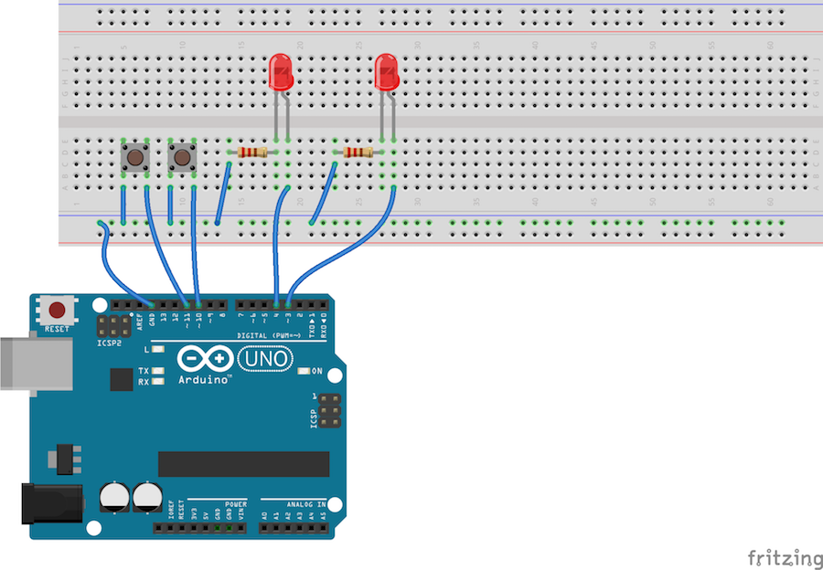

# Merjenje časa

## Dve tipki

**Naloga 4.1** Za ogrevanje sestavi vezje z dvema tipkama in dvema diodama ter program, ki skrbi, da je takrat, ko je pritisnjena ena tipka, prižgana ena dioda, ko druga, pa druga.

**Naloga 4.2** Napiši program, ki takrat, ko je pritisnjena tipka, prižge diodo in jo ugasne čez tri sekunde. Pozabi, da imaš dve diodi (vendar ne razdiraj vezja) in to za zdaj naredi le za eno.

**Naloga 4.3** Zdaj pa dodaj v ta program še drugo tipko, ki prižiga drugo diodo.

Ti je uspelo. Imenitno. Zdaj pa poskusi to: pritisni tipko. Medtem ko dioda sveti, pritisni še drugo tipko. Se je druga dioda prižgala (in zakaj ne :)?

Arduino čepi v ukazu `delay`. Čaka. Tri sekunde ne počne ničesar. Ne prižiga, ne ugaša - in tudi tipk ne gleda. Program miruje. Ukaz `delay` je bolj zoprna zadeva, kot smo si mislili.

## Namesto ukaza `delay`

Da si poenostavimo razmišljanje, se bomo spet ukvarjali z eno samo tipko. Ko jo pritisnemo, želimo prižgati diodo in jo čez 3 sekunde ugasniti. Pri tem - v izogib sitnostim - nočemo uporabiti ukaza `delay`.

Bojni načrt je takšen:

    void setup() {
        nastavi pin mode, kot je potrebno
    }
    
    void loop() {
        če je tipka pritisnjena {
            prižgi diodo
            zapomni si trenutni čas
        }

        če je trenutni čas za več kot 3 s večji od časa, ko si prižgal diodo {
            ugasni diodo
        }
    }

Ob tem programu se moramo zavedati, da Arduino stalno ponavlja, kar piše v `loop`. Če je dioda prižgana (in tipka ni več pritisnjena) bo stalno gledal, ali je trenutni čas že za več kot 3 s večji od časa, ko smo prižgali diodo. Prej ko slej bo, in takrat jo bomo ugasnili.

Kaj od gornjega že znamo napisati?

Marsikaj od tega že znamo.

    void setup() {
        pinMode(3, OUTPUT);
        pinMode(10, INPUT_PULLUP);
    }

    void loop() {
        if (digitalRead(10) == LOW) {
            digitalWrite(3, HIGH);
            zapomni si trenutni čas
        }

        if (trenutni čas je za več kot 3 s večji od časa, ko si prižgal diodo)
            digitalWrite(3, LOW);
        }
    }

Kako pa Arduino pogleda na uro? Uporabiti moramo `millis()`: ta pove, koliko milisekund je minilo, odkar smo prižgali Arduina. To sicer ni prav zares ura (petnajst čez tri), a za naše potrebe bo zadoščala.

Morda tako?

    void setup() {
        pinMode(3, OUTPUT);
        pinMode(10, INPUT_PULLUP);
   }

    void loop() {
        if (digitalRead(10) == LOW) {
            digitalWrite(3, HIGH);
            int prizgal_ob = millis();
        }

        if (millis() >= prizgal_ob + 3000) {
            digitalWrite(3, LOW);
        }
    }

To ne deluje iz več razlogov. Prvi, na katerega bomo opozorjeni takoj, ko bomo poskušali spraviti program na Arduino, je, da v vrstici `if (millis() > prizgal_ob + 3000) {` spremenljivka `prizgal_ob` ne obstaja.

Ko ustvarimo spremenljivko, je ustvarjena le znotraj zavitih oklepajev. Spremenljivka `prizgi_ob` obstaja le znotraj prvega pogoja. Spravimo jo ven.

    void setup() {
        pinMode(3, OUTPUT);
        pinMode(10, INPUT_PULLUP);
    }

    void loop() {
        int prizgal_ob;

        if (digitalRead(10) == LOW) {
            digitalWrite(3, HIGH);
            prizgal_ob = millis();
        }

        if (millis() >= prizgal_ob + 3000) {
            digitalWrite(3, LOW);
        }
    }

Program je zdaj mogoče prenesti na Arduino, deluje pa še vedno ne. Spremenljivka `prizgal_ob` se na novo ustvari vsakič, ko Arduino izvede, kar piše znotraj `loop`. To ne bo šlo: vsa ideja našega programa je v tem, da Arduino vedno znova izvaja `loop` in vsakič primerja `millis()` z `prizgal_ob + 3000`. Če se `prizgal_ob` ustvari vsakič znova (in ima kar neko vrednost), to ne bo dobro.

    void setup() {
        pinMode(3, OUTPUT);
        pinMode(10, INPUT_PULLUP);
    }

    int prizgal_ob = 0;

    void loop() {
        if (digitalRead(10) == LOW) {
            digitalWrite(3, HIGH);
            prizgal_ob = millis();
        }

        if (millis() >= prizgal_ob + 3000) {
            digitalWrite(3, LOW);
        }
    }

Veliko boljše. Zdaj smo `prizgal_ob` ustvarili izven `loop` in kar zapišemo vanjo, se ohranja med različnimi "izvajanji" tega, kar je v `loop`. Začetno vrednost `prizgal_ob` smo nastavili na 0. Zaradi lepšega.

Takšnim spremenljivkam pravimo *globalne spremenljivke*, saj so vidne v vseh blokih - `setup`, `loop` in takšnih, ki jih bomo morda še napisali.

Dokler ne pritisnemo tipke, bo `prizgal_ob` enak 0 in Arduino bo vedno znova ugašal diodo. Nič hudega. Ko pritisnemo tipko, jo prižge in ponovno jo bo začel ugašati, ko bo `millis()` za več kot 3000 milisekund večji od časa, ko smo jo ugasnili.

Zakaj pišemo `millis() >= prizgal_ob + 3000` in ne `millis() == prizgal_ob + 3000`? Saj menda hočemo ugasniti diodo *točno takrat* in ne malo kasneje? To je potrebno, ker se lahko zgodi, da bo Arduino zamudil točen čas.

Poženi program in ga preskusi.

Najbrž boš opazil, da nekaj časa deluje, potem pa nenadoma neha. Težava je tule: spremenljivke vrste `int` lahko shranjujejo števila od -32768 do 32767. Če je Arduino prižgan že 50 sekund, `millis()` vrne 50000. Ko poskušamo to shraniti v `prizgal_ob`, se shrani ... kaj drugega. Ni važno kaj, a 50000 prav gotovo ne.

Kako naredimo spremenljivke za večje številke? Namesto `int` napišemo `long`.

    void setup() {
        pinMode(3, OUTPUT);
        pinMode(10, INPUT_PULLUP);
    }

    long prizgal_ob = 0;

    void loop() {
        if (digitalRead(10) == LOW) {
            digitalWrite(3, HIGH);
            prizgal_ob = millis();
        }

        if (millis() >= prizgal_ob + 3000) {
            digitalWrite(3, LOW);
        }
    }

V `prizgal_ob` bodo šle številke od -2 milijardi do 2 milijardi. To bo dovolj za 2 milijona sekund ali 555 ur ali 23 dni. Dovolj za naše potrebe.

Včasih program raje obrnemo: namesto, kdaj smo prižgali luč, si zapomnimo, kdaj jo je potrebno ugasniti.

    void setup() {
        pinMode(3, OUTPUT);
        pinMode(10, INPUT_PULLUP);
    }

    long ugasni_ob = 0;

    void loop() {
        if (digitalRead(10) == LOW) {
            digitalWrite(3, HIGH);
            ugasni_ob = millis() + 3000;
        }

        if (millis() >= ugasni_ob) {
            digitalWrite(3, LOW);
        }
    }

**Naloga 4.4** Spremeni program tako, da bo delal z dvema diodama.

**Naloga 4.5** Tole pa bo pravi izziv zate. Poglej si program, okrog katerega se je sukala **Naloga 3.5. Kaj dela (2)**. Ga znaš spremeniti tako, da ne bo uporabljal `delay`?

**Naloga 4.6** Ta je za prave mojstre: diode naj se prižigajo, ena po ena, z leve proti desni in nazaj. Ne da bi uporabil `delay`. Če narediš to, si res car ali carica.

# Namigi

#### Naloga 4.1. Dve tipki in diodi

Vse je enako kot pri eni tipki in diodi, le podvojeno.

#### Naloga 4.2. Prižgi, počakaj, ugasni

Če ti kaj pomaga, je tu program v slovenščini:

    če je pritisnjena tipka
        prižgi diodo
        počakaj tri sekunde
        ugasni diodo

Le to prevedi v jezik, ki ga govori (no, bere) Arduino.

#### Naloga 4.3. Prižgi, počakaj in ugasni x 2

Spet le podvoji program, napisan za eno diodo.

#### Naloga 4.4. Prižgi, počakaj in ugasni - brez `delay`

Spet le podvoji. Potreboval boš tudi dve spremenljivki.

#### Naloga 4.5. Naprej brez `delay`

Tako kot si si v prejšnji nalogi zapomnil, kdaj je potrebno ugasniti diodo, si moraš zdaj zapomniti, kdaj je potrebno prižgati naslednjo.

V `loop` ne bo več zanke `while`.

Tudi `i` ne bo smela biti ustvarjena znotraj `loop`, saj si moraš ob različnih klicih `loop` zapomniti, do kje si prišel doslej.

#### Naloga 4.6. Nazaj in naprej, spet brez `delay`

Poleg tega, katera dioda je prižgana, si moraš zapomniti še smer gibanja.

Smer gibanja bo `+1` ali `-1`. Ko trčiš na rob, jo moraš obrniti.

# Rešitve

#### Naloga 4.1. Dve tipki in diodi

    void setup() {
        pinMode(3, OUTPUT);
        pinMode(4, OUTPUT);
        pinMode(10, INPUT_PULLUP);
        pinMode(11, INPUT_PULLUP);
    }

    void loop() {
        if (digitalRead(10) == LOW) {
            digitalWrite(3, HIGH);
        }
        else {
            digitalWrite(3, LOW);
        }
        if (digitalRead(11) == LOW) {
            digitalWrite(4, HIGH);
        }
        else {
            digitalWrite(4, LOW);
        }
    }

#### Naloga 4.2 Prižgi, počakaj, ugasni

    void setup() {
        pinMode(3, OUTPUT);
        pinMode(10, INPUT_PULLUP);
    }

    void loop() {
        if (digitalRead(10) == LOW) {
            digitalWrite(3, HIGH);
            delay(3000);
            digitalWrite(3, LOW);
        }
    }

#### Naloga 4.3. Prižgi, počakaj in ugasni x 2

    void setup() {
        pinMode(3, OUTPUT);
        pinMode(3, OUTPUT);
        pinMode(10, INPUT_PULLUP);
        pinMode(10, INPUT_PULLUP);
    }

    void loop() {
        if (digitalRead(10) == LOW) {
            digitalWrite(3, HIGH);
            delay(3000);
            digitalWrite(3, LOW);
        }
        if (digitalRead(11) == LOW) {
            digitalWrite(4, HIGH);
            delay(3000);
            digitalWrite(4, LOW);
        }
    }

#### Naloga 4.4. Prižgi, počakaj in ugasni - brez `delay`

    void setup() {
        pinMode(3, OUTPUT);
        pinMode(4, OUTPUT);
        pinMode(10, INPUT_PULLUP);
        pinMode(11, INPUT_PULLUP);
    }

    long ugasni_ob_3 = 0;
    long ugasni_ob_4 = 0;

    void loop() {
        if (digitalRead(10) == LOW) {
            digitalWrite(3, HIGH);
            ugasni_ob_3 = millis() + 3000;
        }
        if (millis() >= ugasni_ob_#) {
            digitalWrite(3, LOW);
        }

        if (digitalRead(11) == LOW) {
            digitalWrite(4, HIGH);
            ugasni_ob_4 = millis() + 3000;
        }
        if (millis() >= ugasni_ob_4) {
            digitalWrite(4, LOW);
        }
    }

#### Naloga 4.5. Naprej brez `delay`

V `i` bo shranjeno, katera dioda je trenutno prižgana in v `naprej_ob` bo shranjeno, kdaj je potrebno iti naprej.

Ko je potrebno iti naprej bomo

    ugasnili diodo i
    povečali i
    če je i dosegel 10, ga spremenimo na 3
    prižgamo diodo i
    si zapomnimo, kdaj je potrebno iti naprej

Tako:

    void setup() {
        int i = 3;
        while (i <= 9) {
            pinMode(i, OUTPUT);
            i++;
        }
    }

    int i = 3;
    long naprej_ob = 0;

    void loop() {
        if (millis() > naprej_ob)) {
            digitalWrite(i, LOW);
            i++;
            if (i == 10) {
                i = 3;
            }
            digitalWrite(i, HIGH);
            naprej_ob = millis() + 500;
        }
    }

V začetku je `naprej_ob` enak 0, zato bo `millis()` kar takoj (ali najkasneje v eni tisočinki sekunde) večji od `naprej_ob`.

Katera dioda se bo prva prižgala? Zakaj? Spremeni program tako, da se bo prva prižgala dioda na pinu 3.

#### Naloga 4.5. Nazaj in naprej - spet brez `delay`

Na koncu koncev niti ni tako težko.

V vsakem koraku povečamo `i` za `smer`, torej `i = i + smer;`. Če bo smer enaka `1`, bomo povečali `i` za 1. Če bo smer enaka `-1`, bomo "povečali" `i` za -1 - se pravi, da ga bomo zmanjšali za 1.

Če smo prišli do zadnje diode (`if (i == 9)`) moramo spremeniti smer v -1 (`smer = -1;`), da bomo zmanjševali `i`. Če smo prišli do prve diode (`if (i == 3)`), spremenimo smer v 1 (`smer = 1;`), da bomo povečevali `i`.

To je vsa umetnost.

    void setup() {
        int i = 3;
        while (i <= 9) {
            pinMode(i, OUTPUT);
            i++;
        }
    }

    int i = 3;
    int smer = 1;
    long naprej_ob = 0;

    void loop() {
        if (millis() > naprej_ob)) {
            digitalWrite(i, LOW);
            if (i == 9) {
                smer = -1;
            }
            if (i == 3) {
                smer = 1;
            }
            i = i + smer;
            digitalWrite(i, HIGH);
            naprej_ob = millis() + 500;
        }
    }

Če si prišel do sem in razumeš vse, kar smo napisali, postajaš čisto pravi programer(ka). Bravo.