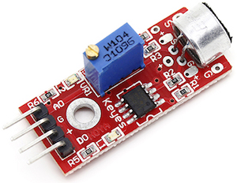

# Merjenje hrupa

Čas je, da se naučimo z Arduinom brati podatke, kot je temperatura, razdalja... Ko to znamo, lahko počnemo z njim vse mogoče: za evro ali dva kupimo senzor za vlago, ga vtaknemo v korito z rožami, na Arduino dodamo še zvočnik in že imamo sistem, ki bo piskal, kadar bodo rože žejne.

Za začetek bomo vzeli mikrofon in merili, kako hrupni smo.

## Izpisovanje z Arduinom

Za začetek se naučimo, kako z Arduinom izpisovati številke. Hm, izpisovati - na kaj? Lahko na Arduino priključimo monitor? Težka bo, saj ima - poleg kupa za to neuporabnih pinov - le USB. V resnici ga ne moremo. Pač pa imamo na Arduino že priključen pravi računalnik, ne?

V programu, s katerim programiramo Arduino, v menuju Tools izberi Serial Monitor. Kar bomo izpisali z Arduinom, se bo izpisalo v to okno. Preskusi tale program.

	void setup() {
        Serial.begin(9600);
        Serial.println("Jaz sem Arduino...);
    }

    void loop() {
        Serial.println("... ki mu je dolgčas");
        delay(2000);
    }

S `Serial.begin(9600);` povemo, da bomo uporabljali USB za "pogovor" med Arduinom in računalnikom. Številka 9600 pove hitrost, s katero se bosta pogovarjala. Ne spreminjaj je; 9600 bo ravno prav.

Nato z ukazom `Serial.println` izpisujemo besedila in številke. Če izpišemo besedilo, ga moramo dati v dvojne narekovaje. Številke pa izpisujemo brez njih, recimo

    Serial.println(42);

Izpisujemo lahko tudi vrednosti spremenljivk, na primer

	int nekaj = 15;
    Serial.println(nekaj);

Ker je `nekaj` spremenljivka, je ne damo v narekovaje. Če bi namreč napisali

	Serial.println("nekaj");

bi se izpisalo besedilo `nekaj` namesto vrednosti spremenljivke `nekaj`.

Ukaz `Serial.println` izpiše besedilo tako, da se naslednji izpis nadaljuje v novi vrstici. Če želimo, da bo naslednji izpis v isti vrstici, namesto njega uporabimo `Serial.print`. Če imamo, recimo, temperaturo, shranjeno v spremenljivki `temp`, bi lahko napisali

	Serial.print("Danes je ");
    Serial.print(temp);
    Serial.println(" stopinj.");

## Mikrofon

Uporabili bomo preprost, cenen mikrofon, primeren za Arduino.

[Mikrofon s slike](http://www.dx.com/p/arduino-microphone-sound-detection-sensor-module-red-135533#.Vxeuk5N96r8) dobimo v [kitajskih spletnih trgovinah](http://www.dx.com) za kaka dva evra. Poštnina je zastonj, čakali pa ga bomo kake tri tedne.

Ploščica ima, kot vidiš, štiri nožice. Previdno ga pritisni v testno ploščo, tako da bo vsaka nožica v svojem stolpcu (ne vrsti - biti mora vzporeden s ploščo, ne pravokoten nanjo). Lahko pa delaš tudi brez testne plošče in natakneš žice naravnost na ploščico z mikrofonom.

Priključiti jo je potrebno tako, da bo `G` povezan z `GND` (na testni plošči ali direktno) in `+` s `+5V`. Poleg tega priključi `A0` na Arduinov `A0`. Četrto nožico, `D0`, pusti.

`A0`? Ne `D0`? Kako beremo z `A0`? Kaj so ti `A0`, `A1` ... in tako naprej?

*Digitalni izhodi* poznajo le dve stanji, `HIGH` in `LOW`. Le tidve stanji lahko napišemo in le tidve stanji lahko beremo. Pini označeni z `A` pa so analogni vhodi. Z Arduinom lahko preberemo električno napetost na teh vhodih.

Ukaz za to se imenuje `analogRead`, dodati pa moramo še oznako pina. Z, recimo `analogRead(A0)` lahko izmerimo napetost na pinu `A0` - ki je slučajno ravno pin, na katerega smo priključili mikrofon.

Kar izmerimo, to izpišimo.

    void setup() {
        Serial.begin(9600);
    }

    void loop() {
        int glasnost = analogRead(A0);
        Serial.println(glasnost);
        delay(100);
    }

`pinMode` ni potrebno nastavljati: ti pini so vedno vhodni.

Poskusi program. Kaj se izpisuje? Da bomo razumeli, kaj smo dobili - in zakaj to ni ravno dobro in uporabno - moramo razumeti, kaj je pravzaprav zvok.

## Zvok

Zvok je valovanje zraka. Zvočnik ima membrano, ki se trese. S tem potiska zrak naprej in nazaj, naša ušesa pa to premikanje zraka zaznajo. Lahko si predstavljamo, da zvočnik proizvaja veter, ki izmenično piha naprej in nazaj. Prav tako "zatrese" zrak okrog sebe struna kitare ali violine ali klavirja. Trobenta trobi, piščalka piska in flavta flavta (glagol *flavtati* je nekoliko nov, a očitno smiseln), ker so oblikovane tako, da zanihajo zrak.

Si kdaj naredil telefon iz plastičnih lončkov, povezanih z nitko? Na eni strani nekdo govori vanj. Zaradi tega se trese dno lončka; vrvica ga povezuje z drugim dnom, ki se zato prav tako trese. Tako se tresenje zraka v prvem lončku prek vrvice prenaša v drugi lonček, kjer dno zatrese zrak v njem.

Če bi zabeležili in narisali gibanje dna lončka naprej in nazaj, bi lahko dobili nekaj takšnega:

Kaj pa počne mikrofon? Predstavljamo si lahko, da mikrofon vsebuje čisto droben plastični lonček (to niti ni tako daleč od resnice - v resnici vsebuje lahko ploščico, ki se trese). Mikrofon v vsakem trenutku izmeri "upognjenost" dna tega lončka; to je številka, ki jo preberemo na pinu `A0`.

Številka, ki jo izmerimo, sama zase torej nima pomena, saj je odvisna od tega, kje je bilo dno ravno v trenutku, ko smo merili. Lahko je na eni strani (številka je velika), lahko je na sredi (številka je "srednja") ali na drugi (številka je majhna). 

Da bi lahko kaj rekli o zvoku, ki ga zaznava, bi morali izmeriti več številk. Recimo sto številk zapored. Največja od njih bi bila potem tem večja, čim glasnejši je zvok. Pravzaprav - zakaj pa ne bi tega naredili?

**Naloga 4.1** Napiši program, ki v `loop` stokrat izmeri zvok in izpiše največjo izmerjeno številko.

**Naloga 4.2** Dopolni program, da si bo poleg izpisal tudi najmanjšo izmerjeno številko in jo izpisal.

**Naloga 4.3** Dopolni program, da bo namesto teh dveh številk izpisal razliko med njima.

In to je to: številka, ki jo izpisuješ, ustreza glasnosti.

**Naloga 4.4** Ne pozabimo, da imamo sedem diod. Dopolni program tako, da bo število diod, ki svetijo, ustrezalo glasnosti. Če je glasnost enaka 1, naj sveti ena dioda, če 2, dve in tako naprej.

# Namigi

#### Naloga 4.1

Verjetno boš potreboval kar tri spremenljivke. Z eno boš štel do 100, da boš stokrat ponovil zanko. V drugo boš zapisal, kar izmeriš, tako kot smo naredili v prvem programu za merjenje glasnosti (ki ni dobro delal). V tretjo si boš zapomnil največjo številko, ki si jo nameril do zdaj. Program pa bo (v slovenščini takšen):

	naglasnejse, kar smo slišali doslej = 0
    i = 0
    dokler je i manjši od 100
        izmeri trenutno glasnost
        če je izmerjena trenutna glasnost večja od največje doslej
            naglasnejše doslej = izmerjena trenutna glasnost
    izpiši najglasnejše doslej

Vrednost "najglasnejšega, kar smo slišali doslej", nastavimo na 0, saj vemo, da bomo že v prvi meritvi namerili več kot toliko.

Zdaj pa le še prevedi to v jezik, ki ga razume Arduino.

#### Naloga 4.2

Potreboval boš še eno spremenljivko, v kateri bo shranjena najmanjša izmerjena vrednost. Njeno začetno vrednost nastavi na 1000, saj vemo, da boš že v prvem merjenju namerili manj kot 1000.

Znotraj zanke po tem, ko preveriš, ali je izmerjena glasnost glasnejša od najglasnejše, dodaj še preverjanje, ali je tišja od najtišje.

#### Naloga 4.3

Samo zamenjaj dva izpisa z enim, ki izpisuje razliko med največjo najmanjšo vrednostjo.

#### Naloga 4.4

Nalogo lahko rešiš na dva načina (no, na veliko, ampak dva se bistveno razlikujeta). Lahko napišeš kup `if`-ov. Za vsako diodo po enega: če je glasnost večja od toliko in toliko, postavim pripadajoči pin na `HIGH`, sicer na `LOW`.

Lahko pa vse to spraviš v zanko, če znaš.

# Rešitve

#### Naloga 4.1

    void setup() {
        Serial.begin(9600);
    }

    void loop() {
        int najvecja = 0;
        int glasnost;
        int i = 0;
        while (i < 100) {
            glasnost = analogRead(A0);
            if (glasnost > najvecja) {
                najvecja = glasnost;
            }
            i++;
        }
        Serial.println(najvecja);
    }

#### Naloga 4.2

    void setup() {
        Serial.begin(9600);
    }

    void loop() {
        int najvecja = 0;
        int najmanjsa = 1000;
        int glasnost;
        int i = 0;
        while (i < 100) {
            glasnost = analogRead(A0);
            if (glasnost > najvecja) {
                najvecja = glasnost;
            }
            if (glasnost < najmanjsa) {
                najmanjsa = glasnost;
            }
            i++;
        }
        Serial.println(najvecja);
        Serial.println(najmanjsa);
    }

#### Naloga 4.3

    void setup() {
        Serial.begin(9600);
    }

    void loop() {
        int najvecja = 0;
        int najmanjsa = 1000;
        int glasnost;
        int i = 0;
        while (i < 100) {
            glasnost = analogRead(A0);
            if (glasnost > najvecja) {
                najvecja = glasnost;
            }
            if (glasnost < najmanjsa) {
                najmanjsa = glasnost;
            }
            i++;
        }
        Serial.println(najvecja - najmanjsa);
    }

#### Naloga 4.4

Rešitev z `if`-i je grozljivo dolga.

    void setup() {
        Serial.begin(9600);
        int i = 3;
        while (i <= 9) {
            pinMode(i, OUTPUT);
            i++;
        }
    }

    void loop() {
        int najvecja = 0;
        int najmanjsa = 1000;
        int glasnost;
        int i = 0;
        while (i < 100) {
            glasnost = analogRead(A0);
            if (glasnost > najvecja) {
                najvecja = glasnost;
            }
            if (glasnost < najmanjsa) {
                najmanjsa = glasnost;
            }
            i++;
        }

        glasnost = najvecja - najmanjsa;  // da ne bomo vsakic sproti racunali
        if (glasnost >= 1) {
            digitalWrite(3, HIGH);
        }
        else {
            digitalWrite(3, LOW);
        }
        if (glasnost >= 2) {
            digitalWrite(4, HIGH);
        }
        else {
            digitalWrite(4, LOW);
        }
        if (glasnost >= 3) {
            digitalWrite(5, HIGH);
        }
        else {
            digitalWrite(5, LOW);
        }
        if (glasnost >= 4) {
            digitalWrite(6, HIGH);
        }
        else {
            digitalWrite(6, LOW);
        }
        if (glasnost >= 5) {
            digitalWrite(7, HIGH);
        }
        else {
            digitalWrite(7, LOW);
        }
        if (glasnost >= 6) {
            digitalWrite(8, HIGH);
        }
        else {
            digitalWrite(8, LOW);
        }
        if (glasnost >= 7) {
            digitalWrite(9, HIGH);
        }
        else {
            digitalWrite(9, LOW);
        }
    }

Vedno, kadar napišemo kaj takega, moramo razmisliti, kako to spraviti v kako spodobnejšo krajšo obliko. Vidimo, da stalno ponavljamo šest vrstic:

        if (glasnost >= 1) {
            digitalWrite(3, HIGH);
        }
        else {
            digitalWrite(3, LOW);
        }

le vsakič z drugimi številkami. Prva številka (tista v `if`) gre od 1 do 7, druga (v `digitalWrite`) pa je vedno za dve večja.

Če to našo številko poimenujemo `i`, moramo z njim šteti od 1 do 7 in ponavljati

            if (glasnost >= i) {
                digitalWrite(i + 2, HIGH);
            }
            else {
                digitalWrite(i + 2, LOW);
            }

Tako dobimo precej krajši program.

    void setup() {
        Serial.begin(9600);
        int i = 3;
        while (i <= 9) {
            pinMode(i, OUTPUT);
            i++;
        }
    }

    void loop() {
        int najvecja = 0;
        int najmanjsa = 1000;
        int glasnost;
        int i = 0;
        while (i < 100) {
            glasnost = analogRead(A0);
            if (glasnost > najvecja) {
                najvecja = glasnost;
            }
            if (glasnost < najmanjsa) {
                najmanjsa = glasnost;
            }
            i++;
        }

        glasnost = najvecja - najmanjsa;  // da ne bomo vsakic sproti racunali
        i = 1;
        while (i <= 7) {
            if (glasnost >= i) {
                digitalWrite(i + 2, HIGH);
            }
            else {
                digitalWrite(i + 2, LOW);
            }
            i++;
        }
    }

