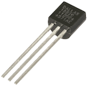
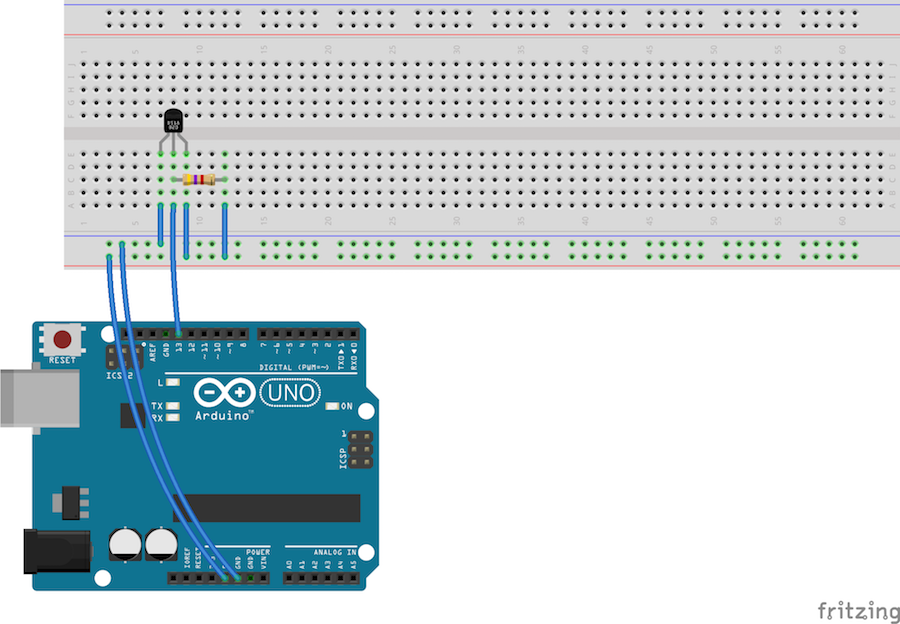

# Merjenje temperature

Čas je, da se naučimo z Arduinom brati podatke, kot je temperatura, razdalja... Ko to znamo, lahko počnemo z njim vse mogoče: za evro ali dva kupimo senzor za vlago, ga vtaknemo v korito z rožami, na Arduino dodamo še zvočnik in že imamo sistem, ki bo piskal, kadar bodo rože žejne.

Za začetek bomo vzeli senzor za temperaturo in z Arduinom merili temperaturo. Kar bomo morali storiti, niti ne bo preveč razburljivo, saj bomo le zložili stvari skupaj po navodilih, ki jih najdemo na spletu ali - v našem primeru - tule. V resnici pogosto delamo tako, saj ne moremo vedno čisto vsega razumeti in čisto vsega napisati od začetka.

## Izpisovanje z Arduinom

Ker še ni čas za zvočnik, bo naš program temperaturo le izpisoval. Hm, kako pa na Arduino priključimo monitor? Težka bo, saj ima - poleg kupa za to neuporabnih pinov - le USB. V resnici ga ne moremo. Pač pa imamo na Arduino priključen pravi računalnik, ne?

V programu, s katerim programiramo Arduino, v menuju Tools izberi Serial Monitor. Kar bomo izpisali z Arduinom, se bo izpisalo v to okno. Preskusi tale program.

	void setup() {
        Serial.begin(9600);
        Serial.println("Jaz sem Arduino...);
    }

    void loop() {
        Serial.println("... ki mu je dolgčas");
        delay(2000);
    }

S `Serial.begin(9600);` povemo, da bomo uporabljali USB za "pogovor" med Arduinom in računalnikom. Številka 9600 pove hitrost, s katero se bosta pogovarjala. Ne spreminjaj je; 9600 bo ravno prav.

Nato z ukazom `Serial.println` izpisujemo besedila in številke. Če izpišemo besedilo, ga moramo dati v dvojne narekovaje. Številke pa izpisujemo brez njih, recimo

    Serial.println(42);

Izpisujemo lahko tudi vrednosti spremenljivk, na primer

	int nekaj = 15;
    Serial.println(nekaj);

Ker je `nekaj` spremenljivka, je ne damo v narekovaje. Če bi namreč napisali

	Serial.println("nekaj");

bi se izpisalo besedilo `nekaj` namesto vrednosti spremenljivke `nekaj`.

Ukaz `Serial.println` izpiše besedilo tako, da se naslednji izpis nadaljuje v novi vrstici. Če želimo, da bo naslednji izpis v isti vrstici, namesto njega uporabimo `Serial.print`. Če imamo, recimo, temperaturo, shranjeno v spremenljivki `temp`, bi lahko napisali

	Serial.print("Danes je ");
    Serial.print(temp);
    Serial.println(" stopinj.");

## Vezje

Vzeli bomo senzor DS18B20.

V [kitajskih spletnih trgovinah](http://www.dx.com) ga dobimo za za kak evro in pol (poštnina je zastonj, čakali pa ga bomo par tednov), v Sloveniji pa bomo zanj dali kak evro več (in ga dobili takoj).

Senzor ima, kot vidiš, tri nožice. Če je senzor obrnjen z ravno stranjo proti nam, moramo na levo nožico pripeljati `GND` in na desno `+5V`. Glej, da tega ne boš zamenjal! Srednjo nožico moramo prek upora približno 4,7 kOhmov povezati s `+5V`. Poleg tega to nožico povežemo s pinom, prek katerega bomo brali podatke s senzorja. Dogovorimo se, da bo to pin `D13`.

Vezje je videti tako. Ponovno: pazi, kako obrneš senzor. `GND` mora priti na levo nožico, če senzor gledaš tako, da je ravni del obrnjen proti tebi.

## Dodatne knjižnice

Kako preberemo podatke s pina 13? Senzor menda ne bo sporočal le `HIGH` in `LOW`?! Za branje podatkov s tega senzorja bomo uporabili ukaze, ki so namenjeni prav temu senzorju. Arduino, oziroma program, ki ga uporabljamo za to, da ga programiramo, seveda ne pozna vseh tisočev in tisočev senzorjev, ki jih lahko obesimo nanj. Za takšne specifične ukaze si moramo namestiti dodatne knjižnice ukazov.

Tule bomo potrebovali dve.

Pojdi v menu Sketch / Include Library / Manage Libraries in vtipkaj onewire. Videl boš seznam knjižnic. Klikni tisto z imenom OneWire (samo OneWire, OneWire-Slave-Hub ali kaj podobnega) in nato Install.

Na enak način dodaj še DallasTemperature - vtipkaj, izberi, Install.

Prva knjižnica, OneWire vsebuje ukaze za branje podatkov z različnih senzorjev (in še česa). Druga, DallasTemperature, vsebuje ukaze za branje podatkov s senzorja, ki ga uporabljamo.

## Program

Kot obljubljeno, tole ne bo preveč razburljivo, saj bomo le uporabljali in prepisovali, kar so za nas pripravili drugi. Vsaj za začetek.

Program je takšen.

    #include <OneWire.h>
    #include <DallasTemperature.h>

    OneWire oneWire(13);
    DallasTemperature sensors(&oneWire);

    void setup() {
        Serial.begin(9600);
        sensors.begin();
    }

    void loop() {
        sensors.requestTemperatures();
        float temp = sensors.getTempCByIndex(0);

        Serial.print("Temperatura: ");
        Serial.println(temp);
        delay(1000);
    }

S prvima vrsticama

    #include <OneWire.h>
    #include <DallasTemperature.h>

povemo, da želimo uporabljati ukaze iz knjižnic OneWire in DallasTemperature, ki smo ju ravnokar namestili.

Z naslednjima dvema

    OneWire oneWire(13);
    DallasTemperature sensors(&oneWire);

povemo prvi knjižnici, da je senzor priključen na pin 13. Z drugim povemo drugi knjižnici (tej, ki je specializirana za naš senzor), naj za branje podatkov uporablja prvo knjižnico. Zakaj sta tadva ukaza natančno takšna, kot sta in kaj v resnici pomenita (tale razlaga je bila namreč malenkost poenostavljena), boš popolnoma razumel šele, če se boš kdaj učil nekega računalniškega jezika z imenom C++.

V `setup` povemo, da bomo prek USBja izpisovali na računalnik (to poznamo že od prej), z drugim pa, da bomo uporabljali senzorje.

Prava akcija je, kot običajno v `loop`. Tam s

	sensors.requestTemperatures();

rečemo senzorju, naj izmeri temperaturo in z

	float temp = sensors.getTempCByIndex(0);

ustvarimo spremenljivko `temp` ter vanjo shranimo temperaturo, ki jo vrne ukaz `sensors.getTempCByIndex(0);`.

Samo malo - ne ustvarjamo spremenljivk z `int`? Ali, kot smo videli ob času, z `long`? Z `int` in `long` bomo dobili celoštevilske spremenljivke. Temperaturni senzor lahko vrne, recimo, 25.18 stopinj, zato potrebujemo spremenljivko, ki lahko shrani tudi necela števila. Takšne spremenljivke ustvarimo s `float`.

Ostanek je jasen: izpišemo besedo `"Temperatura: "` (s `Serial.print`, saj želimo nadaljevati izpis v isti vrstici), nato pa izpišemo še temperaturo (s `Serial.println`), da bo naslednji izpis v naslednji vrstici.

Na koncu počakamo sekundo, da si izpisi ne bodo sledili prehitro.

**Naloga 5.1:** Sestavi vezje, poženi program in opazuj temperaturo. Je pravilna? Primi senzor, da ga malo ogreješ in opazuj izpis. (Tvoji prsti so prehladni in tudi senzor ni narejen tako, da bi ga lahko ogrel na svojo telesno temperaturo. Termometra žal ne boš mogel uporabljati, da bi si meril vročino.)

**Naloga 5.2:** Zakaj ne bi dodali še diod? Če je temperatura v sobi, recimo 22 stopinj, dopolni program tako, da bo svetila ena dioda pri 22 stopinjah, dve pri 23, tri pri 24 in tako naprej. Program preskusi tako, da s prsti ogreješ senzor.

## Merjenje drugih reči

Vlago v zemlji, glasnost zvoka, osvetlitev ... merimo na podoben način. Poiščemo primeren senzor, ugotovimo, kako ga je potrebno priključiti, poiščemo primerno knjižnico zanj in navodila za njeno uporabo, pa smo. Seveda se lahko kje zatakne. Morda smo spregledali, da tega senzorja ni možno priključiti na naš model Arduina, da knjižnica ne deluje, kot bi morala, da senzor ni dovolj občutljiv... Če gre vse gladko, pa uporaba senzorjev z Arduinom ni posebna umetnost.