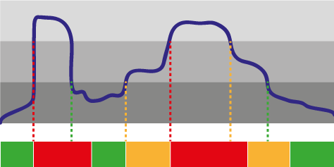

# Semafor hrupa

**Naloga 6.1** Za ogrevanje sestavi vezje z rdečo in zeleno diodo (vmes pa pusti še nekaj prostora za rumeno, ki še pride). Dodaj mu tipko. V začetku naj sveti zelena luč. Ko pritisnemo tipko, naj zasveti rdeča in naj sveti še dve sekundi po tem, ko tipko spustimo.  Pri tem ne uporabi `delay` (z njim ti namreč ne bo uspelo doseči, da bi program pravilno deloval tudi, če tipko držimo malenkost dalj kot dve sekundi - razmisli), temveč to, kar smo se učili o merjenju časa.

**Naloga 6.2** Vzemi program za merjenje glasnosti. Spremeni gornji program tako, da bo namesto tipke uporabljal mikrofon: rdeča luč naj sveti še dve sekundi po tem, ko glasnost preseže neko primerno število (recimo 5).

Ko rešiš nalogi (ne prej!) poglej rešitev. Tam boš videl še nekoliko drugače napisan program, ki ti bo pomagal razmišljati o naslednji nalogi.

**Naloga 6.3** Dodaj še rumeno diodo. Program dopolni, da bo deloval takole:

- Rdeča luč naj sveti še dve sekundi po tem, ko je presežena določena glasnost (recimo 5).
- Rumena luč naj sveti še dve sekundi po tem, ko je presežena določena (manjša) glasnost (recimo 3), vendar le, če ne sveti rdeča luč.
- Zelena naj sveti, če ne sveti rdeča ali rumena.

Recimo, da sveti zelena luč. Iznenada se začne tak trušč, da je potrebno prižgati rdečo. Enako nenadoma utihne. Ne takoj, temveč čez dve sekundi ugasnemo rdečo in spet prižgemo zeleno.

Če hrup narašča bolj zlagoma, prižgemo rumeno. Ko naraste preveč, prižgemo rdečo. Podobno je, če se hrup tiša počasi. Ko dovolj utihne, ostane rdeča prižgana še dve sekundi - čeprav je glasnost že dovolj nizka za rumeno. Ko je hrup že dovolj nizek, sveti rumena še dve sekundi.

# Namigi

#### Naloga 6.1. Zelena in rdeča luč

Poglej programe, ki smo jih pisali ob merjenju časa. Najbrž ti bo prišel bolj prav tisti z eno tipko in diodo. Dodati moraš le še, da ob prižiganju rdeče ugasneš zeleno in obratno.

#### Naloga 6.2. Rdeča luč za hrup

Iz programa za merjenje glasnosti, ki smo ga pisali pred časom, skopiraj vrstice, ki so izmerila glasnost. Postavi jih na začetek `loop`. Nato v programu iz prejšnje naloge samo zamenjaj `if tipka je pritisnjena` z `if glasnost je prevelika`.

#### Naloga 6.3. Končno: semafor

Dodaj še `rumena_do`. Postavi jo na podoben način kot `rdeca_do`, le z drugačno mejo za glasnost.

Nato boš moral spremeniti še tisti del programa, ki prižiga luči. Če (`if`) smo v času, ko moramo biti prižgana rdeča, prižgemo rdečo. Sicer, če (`else if`!) smo v času, ko mora biti še prižgana rumena, prižgemo rumeno. Sicer (`else`) prižgemo zeleno.

# Rešitve

#### Naloga 6.1. Zelena in rdeča luč

Recimo, da sta diodi na pinih 3 (zelena) in 5 (rdeča), stikalo pa na 10.

    void setup() {
        pinMode(3, OUTPUT);
        pinMode(5, OUTPUT);
        pinMode(10, INPUT_PULLUP);
        digitalWrite(3, HIGH);
    }

	long ugasni_rdeco_ob = 0;

    void loop() {
        if (digitalRead(10) == LOW) {
            digitalWrite(3, LOW);  // ugasni zeleno
            digitalWrite(5, HIGH);  // prizgi rdeco
            ugasni_rdeco_ob = millis() + 2000;
        }
        if (millis() >= ugasni_rdeco_ob) {
            digitalWrite(3, HIGH);  // prizgi zeleno
            digitalWrite(5, LOW);  // ugasni rdeco
        }
    }

Program bomo, da bodo stvari kasneje lepše tekle, obrnili malo drugače. 

    void setup() {
        pinMode(3, OUTPUT);
        pinMode(5, OUTPUT);
        pinMode(10, INPUT_PULLUP);
        digitalWrite(3, HIGH);
    }

	long rdeca_do = 0;

    void loop() {
        if (digitalRead(10) == LOW) {
            rdeca_do = millis() + 2000;
        }

        if (millis() < rdeca_do) {
            digitalWrite(3, LOW);
            digitalWrite(5, HIGH);
        }
        else {
            digitalWrite(3, HIGH);
            digitalWrite(5, LOW);
        }
    }

V `rdeca_do` shranjujemo, do kdaj mora biti prižgana rdeča luč. Če je pritisnjena tipka, si zapomnimo, da mora biti rdeča prižgana do trenutnega časa + 2000 milisekund.

V drugem delu `loop` poskrbimo, da je prižgana ustrezna luč. Če je trenutni čas manjši od onega, do katerega mora biti prižgana rdeča luč, ugasnemo zeleno in prižgemo rdečo, sicer pa ravno obratno.

Večino časa bomo prižigali, kar je itak že prižgano in ugašali, kar je že ugasnjeno. Nič hudega. Arduinu je tako ali tako večinoma dolgčas; naj se zabava s prižiganjem prižganega - zakaj pa ne. :) S tem ne bo spremenil ničesar, saj diode ne more prižgati *še bolj* kot je prižgana.

#### Naloga 5.2 Rdeča luč za hrup

Program je sicer sakramensko dolg, a sestavljen iz samih znanih kosov.

    void setup() {
        pinMode(3, OUTPUT);
        pinMode(5, OUTPUT);
        pinMode(10, INPUT_PULLUP);
        digitalWrite(3, HIGH);
    }

	long rdeca_do = 0;

    void loop() {
        // Izmerimo glasnost, kot smo se naučili pred časom
        int najvecja = 0;
        int najmanjsa = 1000;
        int glasnost;
        int i = 0;
        while (i < 100) {
            glasnost = analogRead(A0);
            if (glasnost > najvecja) {
                najvecja = glasnost;
            }
            if (glasnost < najmanjsa) {
                najmanjsa = glasnost;
            }
            i++;
        }
        glasnost = najvecja - najmanjsa;

        // naprej pa je vse isto kot prej, le z glasnostjo namesto tipke
        // ce je glasnost vecja od 5, si zapomnimo, da mora biti se do
        // dveh sekund od zdaj prizgana rdeca luc
        if (glasnost > 5) {
            rdeca_do = millis() + 2000;
        }

        if (millis() < rdeca_do) {
            digitalWrite(3, LOW);
            digitalWrite(5, HIGH);
        }
        else {
            digitalWrite(3, HIGH);
            digitalWrite(5, LOW);
        }
    }

#### Naloga 5.3 Končno: semafor

Kot obljubeno: vse je enako, le z eno lučjo več. Program je napisan, kot da je rumena luč na pinu 4.

    void setup() {
        pinMode(3, OUTPUT);
        pinMode(4, OUTPUT);
        pinMode(5, OUTPUT);
        pinMode(10, INPUT_PULLUP);
        digitalWrite(3, HIGH);
    }

	long rdeca_do = 0;
    long rumena_do = 0;

    void loop() {
        // Izmerimo glasnost
        int najvecja = 0;
        int najmanjsa = 1000;
        int glasnost;
        int i = 0;
        while (i < 100) {
            glasnost = analogRead(A0);
            if (glasnost > najvecja) {
                najvecja = glasnost;
            }
            if (glasnost < najmanjsa) {
                najmanjsa = glasnost;
            }
            i++;
        }
        glasnost = najvecja - najmanjsa;

        // Zapomnimo si, do kdaj morata biti prižgana rdeca in rumena:
        // - ce je glasnost vecja od 5, si zapomnimo, da mora biti se do
        //   dveh sekund od zdaj prizgana rdeca luc
        if (glasnost > 5) {
            rdeca_do = millis() + 2000;
        }
        // - ce je vecja od 3, pa rumena
        if (glasnost > 3) {
            rumena_do = millis() + 2000;
        }

        // Prizgemo, kar je treba
        if (millis() < rdeca_do) {
            digitalWrite(3, LOW);
            digitalWrite(4, LOW);
            digitalWrite(5, HIGH);
        }
        else {
            if (millis() < rumena_do) {
                digitalWrite(3, LOW);
                digitalWrite(4, HIGH);
                digitalWrite(5, LOW);
            }
            else {
                digitalWrite(3, HIGH);
                digitalWrite(4, LOW);
                digitalWrite(5, LOW);
            }
        }
    }
