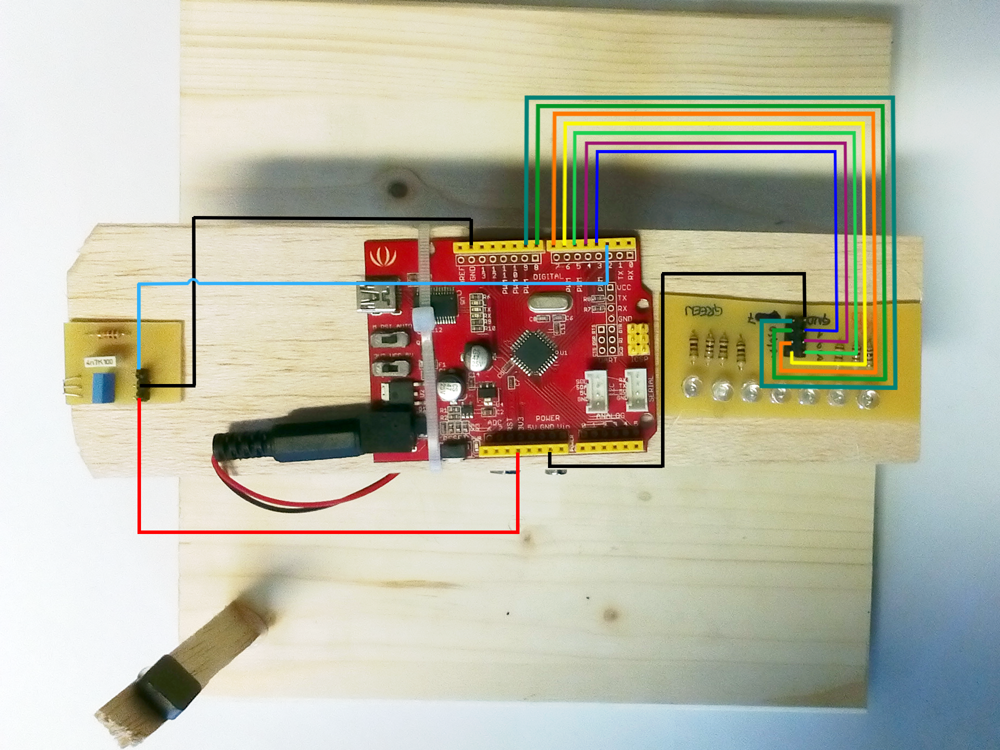

#Vklop LED pri določenem kotu

Komponente vetrnice povežemo tako, kot je prikazano na spodnji shemi.

V funkciji setup() s pomočjo for() zanke nastavimo pine s stevilkami 3,4,5,6,7,8 in 9 kot izhod.

    for(i = 0; i < NUM_LEDS; i++)
        pinMode(ledPins[i], OUTPUT);
        
Kadar gre magnet mimo magnetnega senzorja, se v spremenljivko loopTime shrani čas trajanja zadnjega kroga.

        void isr(){
 
            unsigned long currentTime = micros();
  
            // Racunanje casa enega kroga
            loopTime = currentTime - prevTime;
            prevTime = currentTime;

        }
        
        
V funkciji loop() s pomočjo trenutnega časa in časa zadnjega kroga izračunamo trenutni kot. LED vklopimo, če je trenutni kot med vrednostima ANGLE in ANGLE + ANGLE_WIDTH. Kadar je trenutni kot večji od vrednosti ANGLE + ANGLE_WIDTH, LED izklopimo.

        void loop(){
  
            // Kadar cas, preracunan v stopinje ustreza stopinjam ANGLE, vklopimo LED. LED so vklopljene toliko                casa, dokler ne dosezejo kota ANGLE + ANGLE_WIDTH
            currentTime = micros();
            if((currentTime - prevTime) * 360.0 / loopTime >= ANGLE && (currentTime - prevTime) * 360.0 / loopTime <= ANGLE + ANGLE_WIDTH)
                showLeds(true);
            else if((micros() - prevTime) * 360.0 / loopTime > ANGLE + ANGLE_WIDTH)
                showLeds(false);
    
        }
        
#Celotna koda programa

    #define ANGLE 320
    #define ANGLE_WIDTH 30

    volatile unsigned long loopTime = 1;
    volatile unsigned long prevTime = 1;
    unsigned long currentTime;
    const byte ledPins[] = {3,4,5,6,7,8,9};

    void setup(){

        byte i;
  
        // Nastavi LED pine kot izhod
        for(i = 0; i < sizeof(ledPins); i++)
            pinMode(ledPins[i], OUTPUT);
    
        // Omogoci prekinitve na pinu 2
        attachInterrupt(0, isr, FALLING);
  
    }

    void loop(){
  
    // Kadar cas, preracunan v stopinje ustreza stopinjam ANGLE, vklopimo LED. LED so vklopljene toliko casa, dokler ne dosezejo kota ANGLE + ANGLE_WIDTH
    currentTime = micros();
    if((currentTime - prevTime) * 360.0 / loopTime >= ANGLE && (currentTime - prevTime) * 360.0 / loopTime <= ANGLE + ANGLE_WIDTH)
        showLeds(true);
    else if((micros() - prevTime) * 360.0 / loopTime > ANGLE + ANGLE_WIDTH)
        showLeds(false);
    
    }

    void showLeds(boolean show){
  
        byte i;
  
        // Vklop, oziroma izklop LED
        for(i = 0; i < sizeof(ledPins); i++){
            show == true ? digitalWrite(ledPins[i], HIGH) : digitalWrite(ledPins[i], LOW);
        }   
  
    }

    void isr(){
 
        unsigned long currentTime = micros();
  
        // Racunanje casa enega kroga
        loopTime = currentTime - prevTime;
        prevTime = currentTime;

    }
